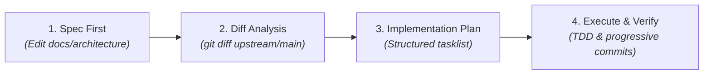

# Doc-Driven Architecture (DDA) Skill

Facilitates the **Doc-Driven Architecture** workflow in Canon Clerk. In this repository, `docs/architecture/` and `SPEC.md` serve as the sole authoritative specification of the system. New features and behavioral changes are specified in documentation first, followed by diff-driven implementation planning and execution.

---

## The 4-Step Engineering Loop

### 1. Spec First (Design Phase)
- Author or update architectural specifications under `docs/architecture/` (or `SPEC.md`).
- Ensure all relevant contracts are explicitly defined:
  - Localized Mermaid dataflow diagrams (inputs, outputs, exit codes).
  - Caseload delta schemas (e.g., `CaseloadConfig`, `CaseloadDocket`).
  - Core functional signatures and pseudo-structs.
  - CLI flags, environment fallbacks, and exit codes (`0`, `1`, `2`).
  - Stage-prefixed threshold scoping and reason-first LLM decoding schemas where applicable.
- Commit doc-only changes using `spec(<surface>):` or `docs(architecture):`.

### 2. Diff Analysis
When instructed to plan or implement changes:
- Run `git diff upstream/main -- docs/architecture/ SPEC.md` to identify all contract shifts.
- Categorize changes into:
  - **Schema/Model shifts:** Fields added, modified, or removed on `Caseload`.
  - **Interface shifts:** CLI flags, environment variables, or error codes.
  - **Domain logic shifts:** Evaluation rules, thresholds, or short-circuit invariants.
  - **Adapter shifts:** Terminal output formatting, pipeline funnel receipt, or GitHub Action mapping.

### 3. Implementation Planning
Draft an implementation checklist organized into logical, progressive milestones:
1. **Core Domain & Types:** Update data structures and pure evaluation logic.
2. **Adapters & CLI:** Update argument parsing, environment fallbacks, and exit code mappings.
3. **Tests & Fixtures:** Add unit tests, DAG scheduling tests, and synthetic fixtures covering new contracts.
4. **Integration Verification:** Run test suites and verify exit code semantics.

### 4. Execute & Verify
- Implement tasks in cohesive batches.
- Maintain progressive Conventional Commits with SSH signing:
  - `feat(<scope>): ...` for new capabilities.
  - `fix(<scope>): ...` for bug repairs.
  - `refactor(<scope>): ...` for structural refactors without behavior change.
  - `test(<scope>): ...` for test suite additions.
- Ensure all tests pass and documentation remains 100% synchronized with code.
