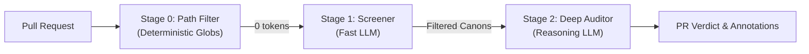

# Canon Clerk

**Canon Clerk** combines an open specification for authored project rules (*canons*) with an automated, LLM-powered review gate (*clerk*) that audits pull requests against architectural invariants in CI.

**Problem:** AI tools have accelerated and automated code generation, making project maintainers and custodians acute bottlenecks. Maintainers bear an asymmetric cognitive tax, reverse-engineering unsolicited but plausible AI-assisted PRs that pass existing tests but quietly violate unwritten or scattered architectural rules and project tenets.

**Solution:** Canon Clerk introduces a zero-friction Markdown format for _project canons_ which live in `.canons/` directories. Through its CLI or GitHub Action, Canon Clerk checks proposed changes against canons for applicability and conformance. By gating CI on canon adherence, Canon Clerk preserves maintainer attention for truly novel situations.

---

## Overview

Traditional AST-based linters excel at syntax and static analysis, but fail on semantic guidelines that require contextual comprehension:
- *"Did this UI change include a reproducible manual test script in the description?"*
- *"Does this new service violate our bounded context isolation boundaries?"*
- *"Are customer-facing API error messages conforming to our voice-and-tone standards?"*

Canon Clerk automates targeted, gating, semantic review using your project's rules written in plain Markdown.

---

## How It Works

Canon Clerk runs locally or in CI through an efficient three-stage cascade:



1. **Stage 0: Path Filter (Deterministic)**  
   Instantly discards canons whose file globs don't match the PR's modified files (zero cost, zero latency).
2. **Stage 1: Screener (Fast LLM or System One Model)**  
   Batches remaining candidate canons using only PR metadata and diff statistics to filter for possible applicability. Applicable canons become in-progress GitHub Check Runs.
3. **Stage 2: Deep Auditor (Reasoning LLM)**  
   Audits the git diff and context against only screened-in canons, returning a structured verdict (`pass`, `fail`, `action_required`, `warn`, or `skipped`).

For full architectural details on the cascade, see **[Architecture & Evaluation Cascade](docs/architecture.md)**.

---

## Quickstart

### 1. Write a Canon (Zero Friction)

Create a Markdown file inside `.canons/` with a single sentence invariant—no frontmatter or headers required:

```markdown
<!-- .canons/no-undocumented-features.md -->
PRs that introduce new user-facing features must have accompanying documentation in `docs/`.
```

You can optionally tell the clerk how to provide (**Guidance**) or to synthesize (**Supplement**) material inline:

```markdown
<!-- .canons/manual-test-plan-required.md -->
PRs modifying UI components MUST include an industry standard, manual Test Script in the PR description.

**Supplement:** If a manual Test Script is missing, but is feasibly inferred, synthesize a candidate Test Script from the diff and PR description.
```

### 2. Add to GitHub Actions

Add `.github/workflows/canon-clerk.yml`:

```yaml
name: Canon Clerk

on:
  pull_request:
    types: [opened, synchronize, reopened, edited]

jobs:
  audit:
    runs-on: ubuntu-latest
    permissions:
      contents: read
      pull-requests: write
    steps:
      - name: Checkout Code
        uses: actions/checkout@v4
        with:
          fetch-depth: 0

      - name: Run Canon Clerk
        uses: pair-code/canon-clerk@v1
        with:
          github_token: ${{ secrets.GITHUB_TOKEN }}
          screener_model: gemini-3.7-flash
          auditor_model: gemini-3.5-pro
        env:
          GEMINI_API_KEY: ${{ secrets.GEMINI_API_KEY }}
```

---

## Defining Canons: Progressive Disclosure

Canon Clerk is designed to enforce your project's opinions, not to impose its own. Canons scale across progressive tiers:

* **Tier 1 (Minimal):** Plain Markdown assertions with no frontmatter or headers.
* **Tier 2 (Keywords):** Adding inline `**Guidance:**` or `**Supplement:**` directives expands the range of possible clerk outputs.
* **Tier 3 (Cost-Optimized):** Add YAML frontmatter (`paths:`) purely to enable Stage 0 deterministic path filtering at 0 token cost.
* **Tier 4 (Structured):** Multi-section canons with explicit `## Rule`, `## Guidance`, `## Supplement`, or `## Evaluation Criteria` for complex policies with structured rubrics.

### Directives: `Guidance` vs. `Supplement`

Canon Clerk distinguishes between contributor action items and automated AI synthesis:

* **`Guidance` (Contributor Directive $\rightarrow$ Blocking `fail`):** Explains what the _author must do_ to unblock the PR (e.g. pointers to documentation or required templates).
* **`Supplement` (Clerk Synthesis $\rightarrow$ Non-blocking `warn`):** Instructs the Clerk to synthesize missing material directly into the review report. If synthesis is infeasible, it gracefully falls back to a blocking `fail`.

> 📖 **Formal Specification:**  
> For the complete canon grammar, metadata derivation fallbacks (`id`, `title`, `paths`, `inspect`, `tags`), directive semantics, and monorepo scoping rules, see **[SPEC.md](SPEC.md)**.

---

## Verdicts & Feedback

Each canon evaluated by the Deep Auditor completes its GitHub Check Run with one of five conclusions:

| Verdict | GitHub Conclusion | Blocks Merge? | Scope | Description |
| :--- | :--- | :--- | :--- | :--- |
| **`pass`** | `success` 🟢 | No | Both | Canon applies and the PR is compliant. |
| **`fail`** | `failure` 🔴 | **Yes** | **Source Code** | Canon applies, but code is non-compliant. Includes `Guidance` or infeasible `Supplement` attempts. |
| **`action_required`** | `action_required` 🟡 | **Yes** | **Metadata & Process** | Canon applies, but PR metadata/process is non-compliant (e.g. missing test plan, invalid PR description). |
| **`warn`** | `neutral` ⚪ | No | Both | Non-blocking advisory or synthesized `Supplement` (curing the defect). |
| **`skipped`** | `skipped` ⚪ | No | N/A | Canon determined not to interact with this PR upon deep inspection. |

---

## Contributing

Contributions are welcome! Please see [CONTRIBUTING.md](docs/contributing.md) and [Development Workflow](docs/development-workflow.md) for details on how to get started.

## License

Apache 2.0 - See [LICENSE](LICENSE) for details.

---

> *Disclaimer: This is not an officially supported Google product.*
