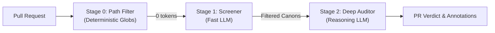
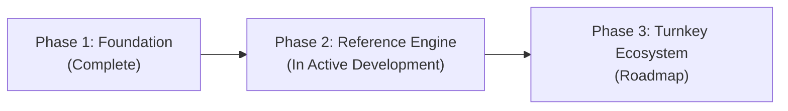

# Canon Clerk

**Canon Clerk** is an open specification and emerging **semantic linter** for software architecture, engineering conventions, and project tenets. It pairs declarative, version-controlled rule packs (*canons*) with an automated multi-stage evaluation engine (*clerk*) that audits pull requests against architectural invariants in CI.

**Problem:** Generative AI tools have accelerated code production, shifting the engineering bottleneck to code custodians and maintainers. Reviewers bear an asymmetric cognitive tax: vetting plausible, AI-assisted pull requests that pass existing unit tests and AST linters, but quietly violate unwritten architectural boundaries, domain conventions, or repository tenets.

**Solution:** Canon Clerk introduces **Semantic Linting**:
- **AST Linters (ESLint, Clippy, Flake8):** Verify syntax, type signatures, and local AST structures.
- **Semantic Linters (Canon Clerk):** Verify architectural invariants, author intent, cross-cutting conventions, and domain policies that static ASTs cannot observe.

Canon Clerk codifies these rules into plain, zero-friction Markdown files stored in `.canons/` directories. Organized into modular, domain-scoped rule packs (such as CLI ergonomics, canon authoring, and Conventional Commits), canons establish clear, enforceable boundaries for human contributors and AI coding assistants alike.

---

## How It Works: The Evaluation Cascade

Canon Clerk audits pull requests through an efficient, three-stage evaluation cascade designed to minimize latency and token costs:



1. **Stage 0: Path Filter (Deterministic):**
   Instantly discards canons whose file globs (`governs:`) don't intersect the PR's modified files (zero cost, zero latency).
2. **Stage 1: Screener (Fast LLM):**
   Screens candidate canons using only PR metadata and diff statistics to identify potentially applicable rules. Screened-in canons transition into in-progress GitHub Check Runs.
3. **Stage 2: Deep Auditor (Reasoning LLM):**
   Audits the git diff and specified context against screened canons, returning a structured verdict (`pass`, `fail`, `action_required`, `warn`, or `skipped`) with actionable guidance or synthesized suggestions.

For complete architectural details, see the **[Architecture & Evaluation Cascade](docs/architecture.md)**.

---

## The Canon Corpus

While the automated reference runner is in active development, Canon Clerk already provides a production-grade corpus of **48 modular, domain-scoped canons** adhering to the formal specification ([`SPEC.md`](SPEC.md)). These rule packs are ready to explore, adapt, and use today:

| Domain Pack | Path | Count | Governed Conventions |
| :--- | :--- | :--- | :--- |
| **CLI Ergonomics** | [`packages/cli/.canons/`](packages/cli/.canons/) | 20 | Strict Unix CLI standards: POSIX streams, `--json` schema output, stable sorting, error remediation hints, exit codes, and non-interactive environment handling. |
| **Canon Authoring** | [`.canons/canon-authoring/`](.canons/canon-authoring/) | 10 | Meta-canons governing canon authoring: atomicity, falsifiability, semantic scope, What-Why-How triad, succinctness, and mutual exclusivity of directives. |
| **Agent Skills** | [`.agents/skills/.canons/`](.agents/skills/.canons/) | 9 | Runtime script standards for AI agent skills: execution targets, command echo traces, unbounded output shunting, and POSIX compliance. |
| **Agent Orientation** | [`.canons/agent-orientation/`](.canons/agent-orientation/) | 1 | Unconditional AI assistant orientation in `AGENTS.md` across worktrees and clones. |
| **Conventional Commits** | [`.canons/conventional-commits/`](.canons/conventional-commits/) | 2 | Semantic commit invariants (`feat` for user-facing functionality, `fix` for user-facing bug fixes). |
| **Git Workflow** | [`.canons/git-workflow/`](.canons/git-workflow/) | 1 | Out-of-band change shunting and sanctioned issue mandate hygiene. |
| **Repository Governance** | [`.canons/internal/`](.canons/internal/) | 5 | Internal dogfood policies: curated `llms.txt` maintenance, domain-scoped tagging, and reusable standards. |

### Adopting Canons Today

You do not need to wait for the automated CI runner to benefit from the canon corpus. Teams and AI coding assistants leverage these rules today:

- **AI Coding Assistants (Claude Code, Cursor, Copilot, Antigravity):** Reference canon directories or individual canons in `AGENTS.md`, system prompts, or cursorrules to anchor agent generation to your team's architectural invariants.
- **Pull Request Review Checklists:** Link directly to version-controlled canons in PR templates to make expectations transparent and citations unambiguous.
- **Architectural Standards:** Use the normative What-Why-How triad ([`SPEC.md`](SPEC.md)) as a clean, standardized format for Architectural Decision Records (ADRs) and engineering tenets.

---

## Defining Canons: Progressive Disclosure

Canon Clerk is designed to enforce your project's opinions, not to impose its own. Canons scale across progressive disclosure tiers:

* **Tier 1 (Minimal):** A single plain Markdown assertion with no frontmatter or headers required:
  ```markdown
  <!-- .canons/no-undocumented-features.md -->
  PRs that introduce new user-facing features must have accompanying documentation in `docs/`.
  ```

* **Tier 2 (Directives):** Adding `**Guidance:**` or `**Supplement:**` directives defines contributor remediation or automated synthesis:
  ```markdown
  <!-- .canons/manual-test-plan-required.md -->
  PRs modifying UI components MUST include an industry standard, manual Test Script in the PR description.

  **Supplement:** If a manual Test Script is missing, but is feasibly inferred, synthesize a candidate Test Script from the diff and PR description.
  ```

* **Tier 3 (Cost-Optimized):** Add YAML frontmatter (`governs:`) to enable Stage 0 deterministic path filtering at 0 token cost:
  ```markdown
  ---
  governs:
    - "packages/ui/**"
  tags:
    - ui-standards
  ---
  UI components MUST provide accessible aria labels for all interactive elements.

  **Guidance:** Add `aria-label` or `aria-labelledby` attributes matching the design system token guide.
  ```

* **Tier 4 (Structured):** Multi-section canons with explicit `## Rule`, `## Rationale`, `## Guidance`, `## Supplement`, or `## Evaluation Criteria` for complex policies with structured rubrics.

### Directives: `Guidance` vs. `Supplement`

Canon Clerk cleanly distinguishes between human action items and automated AI synthesis:

* **`Guidance` (Contributor Directive $\rightarrow$ Blocking `fail`):** Explains what the *author must do* to unblock the PR (e.g. pointers to documentation, required templates, or design system tokens).
* **`Supplement` (Clerk Synthesis $\rightarrow$ Non-blocking `warn`):** Instructs the Clerk to synthesize missing material directly into the review report. If synthesis is infeasible, it gracefully falls back to a blocking `fail`.

> 📖 **Formal Specification:**
> For the complete canon grammar, metadata derivation fallbacks (`id`, `title`, `governs`, `inspect`, `tags`, `references`), directive semantics, and monorepo scoping rules, see **[SPEC.md](SPEC.md)**.

---

## Verdicts & Feedback

Each canon evaluated by the Deep Auditor completes its audit with one of five conclusions:

| Verdict | GitHub Conclusion | Blocks Merge? | Scope | Description |
| :--- | :--- | :--- | :--- | :--- |
| **`pass`** | `success` 🟢 | No | Both | Canon applies and the PR is compliant. |
| **`fail`** | `failure` 🔴 | **Yes** | **Source Code** | Canon applies, but code is non-compliant. Includes `Guidance` or infeasible `Supplement` attempts. |
| **`action_required`** | `action_required` 🟡 | **Yes** | **Metadata & Process** | Canon applies, but PR metadata/process is non-compliant (e.g. missing test plan, invalid PR description). |
| **`warn`** | `neutral` ⚪ | No | Both | Non-blocking advisory or synthesized `Supplement` (curing the defect). |
| **`skipped`** | `skipped` ⚪ | No | N/A | Canon determined not to interact with this PR upon deep inspection. |

---

## Project Status & Roadmap

Canon Clerk is evolving through a phased implementation roadmap:



### Phase 1: Specification & Core Corpus *(Complete)*
- [x] **Normative Specification:** Formal canon grammar, metadata derivation fallbacks, directive semantics, and progressive tiers codified in [`SPEC.md`](SPEC.md).
- [x] **Dogfood Canon Corpus:** 48 production-grade canons across 5 domain packs governing CLI ergonomics, canon authoring, AI agent skills, Conventional Commits, and repo governance.
- [x] **Agent Orientation:** Curated machine-readable entry points in [`llms.txt`](llms.txt) and [`AGENTS.md`](AGENTS.md).

### Phase 2: Reference Engine & CLI Runner *(In Active Development)*
- [ ] **TypeScript Monorepo Foundation:** Scaffold `@canon-clerk/schema`, `canon-clerk` CLI, and `@canon-clerk/action` workspaces with Vitest and tsup ([#7](https://github.com/PAIR-code/canon-clerk/issues/7)).
- [ ] **Discovery & Inspection CLI:** Fast, zero-token deterministic query suite (`canon-clerk list`) supporting path filtering, reverse lookups, and graph health diagnostics ([#38](https://github.com/PAIR-code/canon-clerk/issues/38)).
- [ ] **Multi-Stage Evaluation Runner:** Reference implementation of Stage 0 (path filtering), Stage 1 (screening), and Stage 2 (deep reasoning audit) ([docs/architecture.md](docs/architecture.md)).

### Phase 3: Turnkey Distribution & Ecosystem *(Roadmap)*
- [ ] **Zero-Friction Preset Adoption:** Declarative `.canons.yaml` configuration and ephemeral CLI `--preset` execution without repository pollution ([#75](https://github.com/PAIR-code/canon-clerk/issues/75)).
- [ ] **Official GitHub Action:** Turnkey `pair-code/canon-clerk@v1` distribution for native GitHub Actions CI integration and Check Run reporting.
- [ ] **Pack Registry & Community Presets:** Centralized distribution for reusable domain packs.

---

## Contributing

Contributions are welcome! Please see [CONTRIBUTING.md](docs/contributing.md) and [Development Workflow](docs/development-workflow.md) for details on how to get started.

## License

Apache 2.0 - See [LICENSE](LICENSE) for details.

---

> *Disclaimer: This is not an officially supported Google product.*
