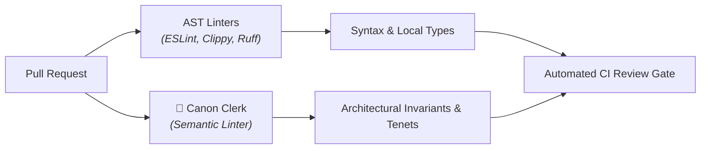

  <picture>
    <source media="(prefers-color-scheme: dark)" srcset="assets/logo-dark.png">
    <source media="(prefers-color-scheme: light)" srcset="assets/logo-light.png">
    
  </picture>

# 📜 Canon Clerk

**Canon Clerk** is an open specification and emerging **semantic linter** for software architecture, engineering conventions, and project tenets. It pairs declarative, version-controlled rule packs (*canons*) with an automated multi-stage evaluation engine (*clerk*) that audits pull requests against architectural invariants in CI.

---

## Why This? Why Now?

**Problem:** Generative AI tools have accelerated code production, shifting the engineering bottleneck to code custodians and maintainers. Reviewers bear an asymmetric cognitive tax: vetting plausible, AI-assisted pull requests that pass existing unit tests and AST linters, but quietly violate unwritten architectural boundaries, domain conventions, or repository tenets.

**Solution:** Canon Clerk introduces **Semantic Linting**:
- **AST Linters (ESLint, Clippy, Flake8):** Verify syntax, type signatures, and local AST structures.
- **Semantic Linters (Canon Clerk):** Verify architectural invariants, author intent, cross-cutting conventions, and domain policies that static ASTs cannot observe.

Canon Clerk codifies these rules into plain, zero-friction Markdown files stored in `.canons/` directories. Organized into modular, domain-scoped rule packs (such as CLI ergonomics, canon authoring, and Conventional Commits), canons establish clear, enforceable boundaries for human contributors and AI coding assistants alike.

---

## Who Needs This?

Canon Clerk addresses the friction points where static code analysis ends and semantic engineering intent begins:

### 1. Maintainers & Code Custodians
* **The Challenge:** Drowning in plausible, syntactically clean PRs—especially generated by AI coding tools—that pass unit tests and AST linters, but quietly violate unwritten architectural boundaries, cross-cutting conventions, or project tenets.
* **With Canon Clerk:** Codify project knowledge into version-controlled, modular rule packs that gate CI objectively. Stop repeating the same review feedback in pull request comments.

### 2. AI-First Teams & Pair Programmers
* **The Challenge:** AI coding assistants (Claude Code, Cursor, Copilot, Antigravity) produce code rapidly, but may invent idiosyncratic patterns, or drift from codebase conventions unless strictly anchored.
* **With Canon Clerk:** Canons provide compact, high-signal, falsifiable rules that anchor AI coding agents during generation (via `AGENTS.md` or `.canons/`), and enforce them semi-deterministically before changes merge.

### 3. Platform & Monorepo Architects
* **The Challenge:** Enforcing cross-cutting standards (CLI design ergonomics, API error schemas, logging invariants, bounded context isolation) across multiple languages usually requires building and maintaining brittle, custom AST compiler plugins for every language toolchain.
* **With Canon Clerk:** A single, stack-ambivalent format using plain Markdown rules scoped to specific directory trees (`packages/cli/.canons/`, `services/auth/.canons/`) without language toolchain dependencies.

### 4. Open-Source Project Leads
* **The Challenge:** Onboarding external contributors is exhausting when review feedback feels subjective, unwritten, or gatekeep-y ("we don't do it that way here"), burning maintainer goodwill and frustrating new contributors.
* **With Canon Clerk:** Transparent, objective, self-service guardrails committed right in the repository. Contributors see expectations upfront, and CI provides actionable remediation (`Guidance`) when invariants are violated.

---

## The Canon Corpus

While the automated reference runner is in active development, Canon Clerk already provides a production-grade corpus of **57 modular, domain-scoped canons** adhering to the formal specification ([`SPEC.md`](SPEC.md)). These rule packs are ready to explore, adapt, and use today:

| Domain Pack | Path | Count | Governed Conventions |
| :--- | :--- | :--- | :--- |
| 🛠️ **CLI Ergonomics** | [`packages/cli/.canons/`](packages/cli/.canons/) | 20 | Strict Unix CLI standards: POSIX streams, `--json` schema output, stable sorting, error remediation hints, exit codes, and non-interactive environment handling. |
| 📜 **Canon Authoring** | [`.canons/canon-authoring/`](.canons/canon-authoring/) | 11 | Meta-canons governing canon authoring: atomicity, falsifiability, semantic scope, What/When/Why/How tetrad, succinctness, and directive contracts. |
| 🤖 **Agent Skills** | [`.agents/skills/.canons/`](.agents/skills/.canons/) | 9 | Runtime script standards for AI agent skills: execution targets, command echo traces, unbounded output shunting, and POSIX compliance. |
| 📝 **README Authoring** | [`.canons/readme-authoring/`](.canons/readme-authoring/) | 5 | Inverted pyramid orientation (lead with what and why), no unreleased roadmaps/vaporware, synchronization with user-facing features, responsive dark/light hero banners, and shunting architecture to `docs/`. |
| 🧭 **Agent Orientation** | [`.canons/agent-orientation/`](.canons/agent-orientation/) | 1 | Unconditional AI assistant orientation in `AGENTS.md` across worktrees and clones. |
| 🏷️ **Conventional Commits** | [`.canons/conventional-commits/`](.canons/conventional-commits/) | 2 | Semantic commit invariants (`feat` for user-facing functionality, `fix` for user-facing bug fixes). |
| 🔀 **Git Workflow** | [`.canons/git-workflow/`](.canons/git-workflow/) | 1 | Out-of-band change shunting and sanctioned issue mandate hygiene. |
| 🎨 **Visual Identity** | [`.canons/visual-identity/`](.canons/visual-identity/) | 1 | Standalone brand iconography isolation, transparent canvas defaults, and defringed alpha perimeter standards. |
| 🏛️ **Repository Governance** | [`.canons/internal/`](.canons/internal/) | 7 | Internal dogfood policies: curated `llms.txt` maintenance, domain-scoped tagging, and reusable standards. |

### Adopting Canons Today

You do not need to wait for the automated CI runner to benefit from the canon corpus. Teams and AI coding assistants leverage these rules today:

- **AI Coding Assistants (Claude Code, Cursor, Copilot, Antigravity):** Reference canon directories or individual canons in `AGENTS.md`, system prompts, or cursorrules to anchor agent generation to your team's architectural invariants.
- **Pull Request Review Checklists:** Link directly to version-controlled canons in PR templates to make expectations transparent and citations unambiguous.
- **Architectural Standards:** Use the normative What/When/Why/How tetrad ([`SPEC.md`](SPEC.md)) as a clean, standardized format for Architectural Decision Records (ADRs) and engineering tenets.

---

## Contributing

Contributions are welcome! Please see [CONTRIBUTING.md](docs/contributing.md) and [Development Workflow](docs/development-workflow.md) for details on how to get started.

## License

Apache 2.0 - See [LICENSE](LICENSE) for details.

---

> *Disclaimer: This is not an officially supported Google product.*
