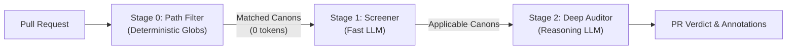

# Architecture & Evaluation Cascade

**Status:** Aspirational Architectural Waypoint (Formal machine contracts will be codified in OpenSpec).

---

## 1. Overview & Motivation

Canon Clerk is designed to audit pull requests against natural language project invariants without incurring the latency and cost of running large reasoning models over every canon for every commit.

To balance token economics, latency, and audit rigor, Canon Clerk executes audits through a **three-stage evaluation cascade**:

By cascading from deterministic filters to lightweight screening and finally to deep reasoning, Canon Clerk minimizes API costs while maintaining high-fidelity review gates.

---

## 2. The Three-Stage Cascade

### Stage 0: Path Filter (Deterministic)
* **Goal:** Instantly discard canons whose file boundaries do not intersect with the changes in the pull request.
* **Cost & Latency:** 0 tokens, near-instantaneous execution.
* **Mechanism:**
  * Compares the list of modified files against each canon's `triggers:` globs.
  * Honors monorepo package boundaries: a canon residing in `<scope>/.canons/` automatically inherits an implicit `<scope>/**` path filter.
  * If a canon specifies no `triggers:` filter and is located at root, it defaults to `["**/*"]` and always passes Stage 0.

### Stage 1: Screener (Fast LLM or System One Model)
* **Goal:** Rapidly determine which remaining candidate canons are plausibly applicable based on high-level PR context.
* **Model Class:** Fast, low-latency models (e.g., Gemini Flash).
* **Inputs:**
  * Pull request metadata: title, description/body, branch name.
  * Diff statistics: touched file list, change counts (lines added/removed).
  * Canon summaries: title, invariant statement, evaluation criteria.
* **Outputs:** A filtered list of canons flagged as potentially applicable.
* **CI Lifecycle:** Canons passing Stage 1 transition into in-progress GitHub Check Runs.

### Stage 2: Deep Auditor (Reasoning LLM)
* **Goal:** Deeply analyze the actual changes to reach a definitive compliance verdict and generate actionable remediation instructions.
* **Model Class:** Frontier reasoning models (e.g., Gemini Pro with reasoning/thinking enabled).
* **Inputs:**
  * Unified git diff of modified files.
  * Scoped context specified by the canon's `inspect:` frontmatter (`diff`, `pr_title`, `pr_body`, `commit_messages`, `linked_issues`).
  * Persistent repository grounding files resolved via the canon's `references:` frontmatter.
  * Full canon text (rule, evaluation criteria, remediation directives).
* **Outputs:** Structured verdict, failure rationale, line-level code annotations, and actionable remediation instructions.

---

## 3. Directives & Execution Mechanics

When evaluating canons against pull request diffs, the Deep Auditor enforces the **What / When / Why / How** tetrad using first-class execution directives defined in [SPEC.md](../SPEC.md):

### 3.1 `Exception` (Permissible Deviations / Conditional Pass)
* **Actor:** Evaluator (Clerk AI).
* **CI Verdict:** Conditional **`pass`** (GitHub conclusion: `success` 🟢).
* **Behavior:** When an invariant violation is detected, the Deep Auditor screens declared `Exception` clauses before issuing a failure. Rather than relying on simple comment flags (`// canon-ignore`), the auditor evaluates the **semantic sufficiency** and factual grounding of the author's justification against the diff and PR context. If all criteria of an exception are met, the check short-circuits and resolves to `pass`, appending an audit verification note to the Check Run summary.
* **Precedence:** Evaluated prior to `Remediation`. If an exception is satisfied, the check passes without requiring contributor remediation.

### 3.2 `Remediation` (Contributor Directive)
* **Actor:** Contributor (Human or AI agent).
* **CI Verdict:** **`fail`** (or **`action_required`** for PR metadata/process issues). Both are **blocking**.
* **Behavior:** The auditor details what the PR author must do to bring the change into compliance (e.g., pointing to required templates, documentation sections, or missing test scenarios).

---

## 4. Verdict Matrix & CI Integration

Each canon evaluated by the Deep Auditor completes its GitHub Check Run with one of four conclusions:

| Engine Verdict | GitHub Check Run Conclusion | Blocks Merge? | Scope | Description |
| :--- | :--- | :--- | :--- | :--- |
| **`pass`** | `success` 🟢 | No | Both | Canon applies and the PR conforms to the invariant, either directly or via a verified `Exception` clause. |
| **`fail`** | `failure` 🔴 | **Yes** | **Source Code** | Canon applies, but code violates the invariant and satisfies zero `Exception` clauses. Includes cases where `Remediation` instructions were provided. |
| **`action_required`** | `action_required` 🟡 | **Yes** | **Metadata & Process** | Canon applies, but PR metadata/process violates the invariant (e.g., missing test plan, invalid PR title). |
| **`skipped`** | `skipped` ⚪ | No | N/A | Canon determined not to interact with this PR upon deep inspection. *(Safety valve for optimistic Stage 1 screening).* |

---

## 5. Spec-Driven Development

As outlined in [Issue #8](https://github.com/PAIR-code/canon-clerk/issues/8), architectural contracts are codified into formal, machine-verifiable specifications using OpenSpec under [`openspec/specs/`](../openspec/specs/):
* [`openspec/specs/core/spec.md`](../openspec/specs/core/spec.md): Formal contracts and staged filtering boundaries for Stages 0, 1, and 2.
* [`openspec/specs/cli/spec.md`](../openspec/specs/cli/spec.md): CLI commands, flags, output formats, and exit code conventions.
* [`openspec/specs/action/spec.md`](../openspec/specs/action/spec.md): GitHub Action inputs, outputs, and Check Run API contracts.
