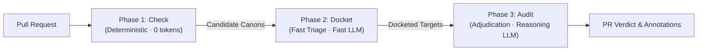

# Architecture & Evaluation Cascade

**Status:** Living Architectural Framework. For the formal multi-phase cascade specification, see **[Three-Phase Evaluation Cascade](architecture/evaluation-cascade.md)**.

---

## 1. Overview & Motivation

Canon Clerk is designed to audit pull requests against natural language project invariants without incurring the latency and cost of running large reasoning models over every canon for every commit.

To balance token economics, latency, and audit rigor, Canon Clerk executes audits through a domain-partitioned **Three-Phase Evaluation Cascade: Check → Docket → Audit**:

By cascading from deterministic filters (Phase 1) to lightweight jurisdiction screening (Phase 2) and finally to targeted deep reasoning (Phase 3), Canon Clerk minimizes API costs while maintaining high-fidelity review gates.

---

## 2. The Three-Phase Cascade

See **[Evaluation Cascade Specification](architecture/evaluation-cascade.md)** for the complete state machine, normative AI contracts, and `FileArtifact` data structures.

### Phase 1: Check (Deterministic Intake · 0 Tokens)
* **Goal:** Instantly verify procedural compliance, syntax/schema validity, and discard canons whose file boundaries do not intersect with PR changes.
* **Normative AI Contract:** **MUST NOT** use AI. 100% deterministic, local, and offline.
* **Commands:**
  * `canon-clerk check-canons`: Validates canon markdown syntax, YAML frontmatter schemas, naming conventions, and structural rules.
  * `canon-clerk check-triggers`: Evaluates file changes against canon declared `triggers:` globs, enforcing monorepo package boundaries (`<scope>/.canons/` $\implies$ `<scope>/**`).

### Phase 2: Docket (Triage & Jurisdiction · Minimal Tokens)
* **Goal:** Rapidly determine which candidate canons have a colorable claim against the PR, and docket specific target diff hunks and referenced exhibits.
* **Normative AI Contract:** **MAY** use AI. **SHOULD** use fast, low-cost triage models (`gemini-3.5-flash-lite`).
* **Commands:**
  * `canon-clerk docket-canons`: Evaluates candidate canons against high-level PR metadata and diff statistics in a single aggregate triage call.
  * `canon-clerk docket-targets`: Resolves specific diff hunks, referenced artifacts, or metadata fields into evidence for each docketed canon.

### Phase 3: Audit (Substantive Adjudication · Targeted Tokens)
* **Goal:** Deeply analyze docketed exhibits to reach a definitive compliance verdict, evaluate exceptions, and generate actionable remediation instructions.
* **Normative AI Contract:** **WILL** use AI. **MAY** use frontier reasoning models (`gemini-3.8-pro`).
* **Commands:**
  * `canon-clerk audit`: Evaluates docketed targets against the What/When/Why/How tetrad, short-circuits verified `Exception` clauses, and posts line-level code annotations.

---

## 3. Directives & Execution Mechanics

When evaluating canons against pull request diffs, the Deep Auditor enforces the **What / When / Why / How** tetrad using first-class execution directives defined in [SPEC.md](../SPEC.md):

### 3.1 `Exception` (Permissible Deviations / Conditional Pass)
* **Actor:** Evaluator (Clerk AI).
* **CI Verdict:** Conditional **`pass`** (GitHub conclusion: `success` 🟢).
* **Behavior:** When an invariant violation is detected, the Deep Auditor screens declared `Exception` clauses before issuing a failure. Rather than relying on simple comment flags (`// canon-ignore`), the auditor evaluates the **semantic sufficiency** and factual grounding of the author's justification against the diff and PR context. If all criteria of an exception are met, the check short-circuits and resolves to `pass`, appending an audit verification note to the Check Run summary.
* **Precedence:** Evaluated prior to `Remediation`. If an exception is satisfied, the check passes without requiring contributor remediation.

### 3.2 `Remediation` (Contributor Directive)
* **Actor:** Contributor (Human or AI agent).
* **CI Verdict:** **`fail`** (or **`action_required`** for PR metadata/process issues). Both are **blocking**.
* **Behavior:** The auditor details what the PR author must do to bring the change into compliance (e.g., pointing to required templates, documentation sections, or missing test scenarios).

---

## 4. Verdict Matrix & CI Integration

Each canon evaluated by the Deep Auditor completes its GitHub Check Run with one of four conclusions:

| Engine Verdict | GitHub Check Run Conclusion | Blocks Merge? | Scope | Description |
| :--- | :--- | :--- | :--- | :--- |
| **`pass`** | `success` 🟢 | No | Both | Canon applies and the PR conforms to the invariant, either directly or via a verified `Exception` clause. |
| **`fail`** | `failure` 🔴 | **Yes** | **Source Code** | Canon applies, but code violates the invariant and satisfies zero `Exception` clauses. Includes cases where `Remediation` instructions were provided. |
| **`action_required`** | `action_required` 🟡 | **Yes** | **Metadata & Process** | Canon applies, but PR metadata/process violates the invariant (e.g., missing test plan, invalid PR title). |
| **`skipped`** | `skipped` ⚪ | No | N/A | Canon determined not to interact with this PR upon deep inspection. *(Safety valve for optimistic Phase 2 docketing).* |

---

## 5. Spec-Driven Development

As outlined in [Issue #8](https://github.com/PAIR-code/canon-clerk/issues/8), architectural contracts are codified into formal, machine-verifiable specifications using OpenSpec under [`openspec/specs/`](../openspec/specs/):
* [`openspec/specs/schema/spec.md`](../openspec/specs/schema/spec.md): Canonical canon entity representation, AST interfaces, and metadata derivation.
* [`openspec/specs/canon-discovery/spec.md`](../openspec/specs/canon-discovery/spec.md): Filesystem discovery, path triggers, and canon querying.
* [`openspec/specs/canon-linter/spec.md`](../openspec/specs/canon-linter/spec.md): Static linting rules, pure evaluation engine, and workspace orchestration.
* [`openspec/specs/cli/spec.md`](../openspec/specs/cli/spec.md): CLI commands, flags, output formats, and exit code conventions.
* [`openspec/specs/action/spec.md`](../openspec/specs/action/spec.md): GitHub Action inputs, outputs, and Check Run API contracts.
