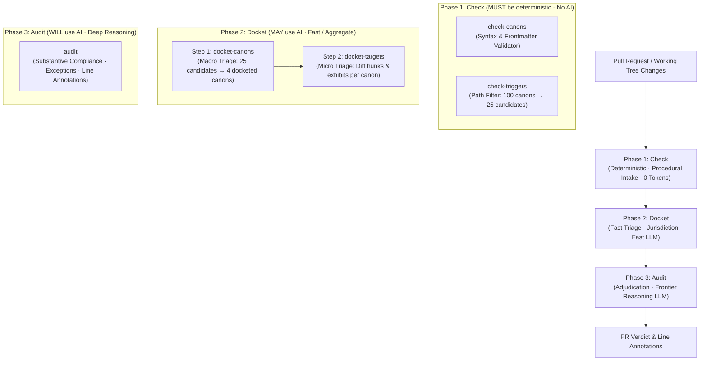

# Three-Phase Evaluation Cascade: Check → Docket → Audit

**Status:** Authoritative Architectural Blueprint for the Clerk Runner.

---

## 1. Executive Summary & The Three Phases

Canon Clerk structures its review gating around the cognitive and administrative division of a **court clerkship**:

1. **Intake & Procedural Checks:** A clerk first checks whether filings satisfy procedural standards and proper filing boundaries.
2. **The Court Docket:** The clerk determines threshold jurisdiction and enters colorable matters and evidentiary exhibits onto the docket.
3. **Judicial Adjudication:** The Judge sits in session to hear the merits of docketed exhibits, evaluate exceptions, and render decrees.

This resolves the core engineering challenge of AI review gates: **enforcing hundreds of semantic repository invariants without incurring prohibitive token costs or multi-minute CI delays**.



---

## 2. Normative Phase Contracts & Verb Taxonomy

Canon Clerk strictly domain-partitions its commands by phase verbs, giving human developers, CI pipelines, and AI coding agents instant predictability regarding operational cost, network requirements, and determinism:

| Phase | Verb Prefix | Normative AI Contract | Primary Role | Cost & Latency |
| :--- | :--- | :--- | :--- | :--- |
| **Phase 1: Check** | **`check-*`** | **MUST NOT** use AI. Must be 100% deterministic, local, and offline. | Procedural validation, file/path filtering, and syntax verification. | **0 tokens** (~5–10ms) |
| **Phase 2: Docket** | **`docket-*`** | **MAY** use AI. **SHOULD** use fast, low-cost, aggregate triage models (`gemini-3.5-flash-lite`). | Evaluates *jurisdiction and relevance* without passing pass/fail judgment. | **Minimal** (~400–800ms) |
| **Phase 3: Audit** | **`audit`** | **WILL** use AI. **MAY** use any frontier reasoning model fit for the task (`gemini-3.8-pro`). | Substantive adjudication against the canon tetrad, exceptions, and line annotations. | **Targeted** (~2–3s) |

---

## 3. Phase 1: Check (Deterministic Pre-Flight)

The **Check Phase** verifies procedural, structural, and path-boundary invariants at zero token cost.

### 1. `canon-clerk check-canons` *(formerly `lint`)*
* **Role:** Static analysis of canon files in the workspace.
* **Checks:** Markdown syntax, YAML frontmatter schema conformance, invariant naming standards (`canon-names-must-state-invariants`), single-rule atomicity, and RFC 2119 keyword formulation.
* **Execution:** Pure deterministic AST analysis.
* **Exit Codes:** `0` on clean lint, `1` on lint violations, `2` on syntax/usage errors.

### 2. `canon-clerk check-triggers`
* **Role:** Deterministic intersection between modified PR/working-tree files and canon declared `triggers:` path globs.
* **Checks:** Matches file paths against globs, automatically enforcing monorepo package boundaries (`<scope>/.canons/` $\implies$ `<scope>/**`).
* **Exit Codes:** `0` on clean execution (or matches present in `--quiet` mode), `1` on zero matches in `--quiet` mode.
* **Output:** Candidate canons list filtered from $N$ total canons down to $M$ candidate canons.

*(Room for Phase 1 Growth: `check-config`, `check-links`, `check-integrity`)*.

---

## 4. Phase 2: Docket (Triage & Jurisdiction)

The **Docket Phase** determines whether candidate canons have a colorable claim against the PR, and which exact targets (diff hunks, persistent references, metadata) fall under their jurisdiction.

### Step 1: `canon-clerk docket-canons` (Macro Triage)
* **Goal:** Triage candidate canons passing `check-triggers` against the high-level PR context in a **single aggregate call**.
* **Question Answered:** *"Does this canon have anything to say about this PR as a whole?"*
* **Model Tier:** `gemini-3.5-flash-lite` (fast, low cost).
* **Inputs:** PR metadata (title, body/description), unified diffs (up to configurable budget, e.g. 100KB, with diff stats fallback), touched file list, and canon summaries (ID, title, invariant statement).
* **Output:**
  ```json
  {
    ".canons/architecture/bounded-contexts.md": {
      "applicabilityReason": "PR modifies only CLI terminal output formatters; no service boundaries altered.",
      "applicabilityScore": 0.05
    },
    ".canons/cli/cli-flags-kebab-case.md": {
      "applicabilityReason": "PR introduces new command flags in packages/cli.",
      "applicabilityScore": 0.95
    }
  }
  ```
* **Filter Gate:** Canons with `applicabilityScore >= 0.5` transition to the Active Docket for Step 2.

### Step 2: `canon-clerk docket-targets` (Micro Triage)
* **Goal:** For a specific docketed canon, identify the exact target diff hunks, referenced persistent artifacts, or metadata fields that fall under its jurisdiction.
* **Question Answered:** *"For this specific canon, which exact diff hunks, referenced artifacts, or metadata fields are in evidence?"*
* **Model Tier:** `gemini-3.5-flash-lite` (temperature 0).
* **Inputs:** Normalized Canon entity + requested inspection context (`diffs`, `references`, `pr_title`, `pr_body`, `commit_messages`, `linked_issues`).
* **Constrained Decoding Schema (Domain-Indirected, Reason-First):**
  ```json
  {
    "diffs": {
      "packages/cli/src/commands/foo.ts": {
        "applicabilityReason": "Adds new CLI option definitions to command parser.",
        "applicabilityScore": 0.95
      },
      "packages/cli/src/formatters.ts": {
        "applicabilityReason": "Modifies terminal color formatting only.",
        "applicabilityScore": 0.10
      }
    },
    "references": {
      "README.md": {
        "applicabilityReason": "Target documentation artifact required to document new subcommands.",
        "applicabilityScore": 0.95
      }
    },
    "pr_title": {
      "applicabilityReason": "Commit title indicates new feature addition.",
      "applicabilityScore": 0.85
    }
  }
  ```
* **Chain-of-Thought Scratchpad:** Generating `applicabilityReason` **before** `applicabilityScore` anchors the probability distribution, ensuring grounded, reproducible scoring.

### Step 3: The `FileArtifact` Abstraction across Diffs and References
To unify data handling across active code modifications (`diffs`) and persistent grounding documents (`references`), Canon Clerk models files via the compound `FileArtifact` entity:
- **`status`:** `'added' | 'modified' | 'deleted' | 'renamed' | 'copied' | 'unchanged'`.
- **`linesAdded` / `linesDeleted`:** Accurate line modification statistics.
- **`patch` (Unified Diff Delta):** Populated for active changes in `diffs`; omitted if unchanged, binary, or oversized (`patchOmissionReason`).
- **`content` (Full Latest Source Text):** Populated by default for persistent grounding files in `references` (read from the active working tree or PR checkout at `HEAD`); omitted by default for `diffs` (`contentOmissionReason: 'not_requested'`) to prevent token blowup on large files with small diffs.
- **Dual Representation for Modified References:** When a persistent reference document (e.g. `README.md`) is also modified in the change, it receives **both** `patch` and `content`. The model sees both the author's new delta and the holistic surrounding document without requiring error-prone mental diff-patching.

---

## 5. Phase 3: Audit (Substantive Adjudication)

The **Audit Phase** evaluates the docketed exhibits against the canon's normative invariant, permissible exceptions, and remediation instructions.

### `canon-clerk audit`
* **Goal:** Deliver authoritative compliance verdicts and generate actionable remediation instructions.
* **Question Answered:** *"Does this change comply with the invariant, violate it, or satisfy an authorized Exception?"*
* **Model Tier:** Frontier reasoning model (`gemini-3.8-pro` with thinking/reasoning enabled).
* **Adjudication Process:**
  1. **Invariant Evaluation:** Evaluates docketed targets against the What (RFC 2119 normative rule).
  2. **Exception Screening:** If a violation is detected, screens against declared `Exception` clauses (When). If semantically satisfied, short-circuits to **`pass`** 🟢.
  3. **Remediation Formulation:** If no exception applies, formulates actionable contributor steps (How) $\to$ **`fail`** 🔴 (or **`action_required`** 🟡 for metadata).
  4. **Line-Level Annotations:** Generates GitHub Check Run annotations with precise file, line, and column coordinates.

---

## 6. End-to-End Orchestration & User Experience

In CI environments (e.g. GitHub Actions) or pre-push git hooks, contributors invoke the flagship orchestrator:

```bash
canon-clerk audit --base origin/main
```

The orchestrator executes the three phases sequentially, providing clean terminal and CI telemetry:

```text
[1/3] Phase 1: Check
      ✓ check-canons: 100 canons valid (0 errors)
      ✓ check-triggers: 100 canons → 24 candidate canons matched (0 tokens, 8ms)

[2/3] Phase 2: Docket
      ✓ docket-canons: 24 candidates → 3 active canons docketed (Flash-Lite, 420ms)
      ✓ docket-targets: 3 canons → 5 docketed targets in evidence (Flash-Lite, 680ms)

[3/3] Phase 3: Audit
      ✓ cli-flags-kebab-case: pass (1 target verified)
      ⚠ readme-must-describe-subcommands: fail (Missing documentation in README.md:42)
      
Conclusion: 1 violation requiring remediation. Process exiting with status 1.
```

---

## 7. Token Economics & Latency Impact

Comparing the Three-Phase Cascade against naive single-stage evaluation (100 canons, 6 modified files):

| Metric | Naive Unfiltered Audit | Three-Phase Cascade (Check → Docket → Audit) | Savings |
| :--- | :--- | :--- | :--- |
| **Phase 1 (Check)** | N/A | 0 tokens (local AST / globs) | — |
| **Phase 2 (Docket)** | N/A | ~6,500 tokens (`gemini-3.5-flash-lite`) | — |
| **Phase 3 (Audit)** | ~200,000+ tokens (`gemini-3.8-pro`) | ~8,000 tokens (`gemini-3.8-pro`) | **~96% token reduction** |
| **Total CI Latency** | 30–45 seconds | < 4.0 seconds | **~88% faster** |
| **Reliability** | Prone to dropped files & hallucinated keys | Zero-drop constrained grammar decoding | **Deterministic guarantee** |
