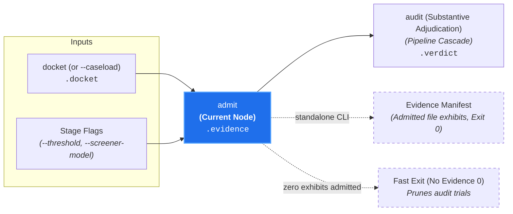

# Evidence Admissibility Triage (`admit`)

**Status:** Authoritative Architectural Standard  
**Core Domain Engine:** Caseload Domain Engine  
**Driving Adapters:** CLI (`admit`), GitHub Action

---

## 1. Domain Concept & Role (`core`)

`admit` performs **Micro Triage: Evidentiary Relevance Screening** for each active Case on the docket. In the court clerkship taxonomy, it represents the clerk reviewing tendered documents, affidavits, and physical exhibits to formally admit only relevant evidence into the case record prior to trial.

- **Imperative Verb:** `admit`
- **Court Clerkship Role:** Micro triage establishing evidentiary admissibility.
- **Metric Pair:** `admissibility_score` (number [0.0, 1.0]) and `admissibility_summary` (string rationale).
- **Core Question:** *"For an active Case, is this candidate exhibit (diff hunk, PR title, PR body, or reference document) admissible as relevant evidence?"*

---

## 2. Dependencies & Prerequisites (`core`)



- **Direct Prerequisites:** `docket` (requires active cases in `caseload.docket.active_docket`).
- **Transitive Prerequisites:** `intake`, `discover`, `validate`, `configure`.
- **Pruned from Execution:** `probe`, `audit`.

---

## 3. Core Functional Contract

```text
struct AdmitOptions:
  threshold?: Float // default: 0.5
  screener_model?: String

function execute_admit(
  options: AdmitOptions,
  caseload: Caseload
) -> Caseload
```

### Caseload Delta
Populates the `.evidence` field on the cumulative `Caseload`:

```text
struct AdmittedExhibit:
  // Repository-relative path to admitted file or exhibit
  file_path: String

  // Relevance score of exhibit to governing canon [0.0, 1.0]
  admissibility_score: Float

  // Rationale for admitting exhibit into evidence
  admissibility_summary: String

struct CanonEvidenceExhibits:
  // Canon file path governing these exhibits
  canon_path: String

  // Admitted evidence exhibits
  exhibits: List[AdmittedExhibit]

struct CaseloadEvidence:
  // Admitted exhibits keyed by canon path
  exhibits: Map[String, CanonEvidenceExhibits]
```

### Domain Short-Circuit Invariant
If all active cases retain zero admitted exhibits:
- Execution terminates immediately with exit code `0`.
- Zero substantive trials (`audit`) are scheduled, avoiding reasoning token expenditures.

---

## 4. Process & Domain Logic (`core`)

1. **Per-Case Evidentiary Review:** Iterates through each canon on `caseload.docket.active_docket`.
2. **Fast Heuristic Screening (`gemini-3.5-flash-lite`):** Evaluates candidate exhibits—including code diff hunks, PR title, PR body, commit messages, and reference documents—against the canon's specific requirements, as declared by its `inspect:` frontmatter.
3. **Constrained Decoding Schema (Domain-Indirected, Reason-First):**
   ```json
   {
     "exhibits": [
       {
         "file_path": "src/commands/docket.rs",
         "admissibility_summary": "Contains option definitions for new CLI command.",
         "admissibility_score": 0.95
       }
     ]
   }
   ```
   Generating `admissibility_summary` before `admissibility_score` provides a chain-of-thought scratchpad, anchoring reproducible probability distributions.
4. **Admissibility Threshold (`admissibility_score >= 0.5`):**
   - Exhibits scoring $\ge 0.5$ are admitted into evidence for that Case.
   - Irrelevant diff hunks are excluded (`admissibility_score < 0.5`).
5. **Dismissal of Cases with Zero Exhibits:** If an active Case retains zero admitted exhibits, it is dismissed without trial.

---

## 5. Driving Adapter: CLI

The CLI exposes `admit` as an imperative subcommand:

```bash
# Execute evidence triage against an upstream Caseload:
canon-clerk admit --caseload caseload-4.json --json

# Run telescoping pipeline stopping at admit:
git diff origin/main | canon-clerk admit --diff -
```

### Missing Input Source Guard (Naked Invocation)
Invoking `canon-clerk admit` naked without a filing source (no diff, no target files, no `--caseload`) fails fast with exit code `2` (Usage Error) and prints actionable guidance:
```text
error: No filing source provided for admit.
  Hint: Pipe a diff via standard input ('--diff -'), specify target files,
        or pass an upstream caseload ('--caseload <path>').
```
Conversely, if an explicitly designated stream yields zero diffs (e.g. `git diff origin/main | canon-clerk admit --diff -` on an up-to-date branch), the pipeline cleanly short-circuits with exit code `0` ("0 modified files; 0 admitted exhibits").

### CLI Flags & Environment
- `--threshold <number>`: Admissibility threshold (default: `0.5`).
- `--caseload <path|->`: Ingests upstream Caseload.
- `--json`: Emits enriched Caseload JSON.

### CLI Exit Codes
- **0:** Exhibits admitted and attached (or zero-evidence short-circuit).
- **2:** Usage error, missing filing source (naked invocation), provider connection error, or model response failure.

---

## 6. Driving Adapter: GitHub Action

1. **Evidence Screening Step:** Invokes `executeAdmit` with the `Caseload`.
2. **Exhibit Accounting:** Logs admitted diff hunks and persistent references per case.
3. **Early Exit:** If zero cases retain admitted evidence, concludes the Check Run as passing without scheduling reasoning models.
