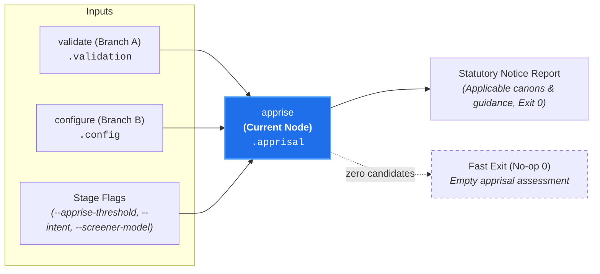

# Statutory Apprisal (`apprise`)

**Status:** Authoritative Architectural Standard  
**Core Domain Engine:** Caseload Domain Engine  
**Driving Adapters:** CLI (`apprise`), GitHub Action

---

## 1. Domain Concept & Role (`core`)

`apprise` performs **Prospective Jurisprudential Screening: Statutory Apprisal for Design-Time Guidance** across all candidate canons matching the prospective target scope.

In the court clerkship taxonomy, `apprise` represents the court exercising its **Apprisal Authority** (*Jurisdictio Notificatoria*). Rather than functioning as a trial judge hearing evidence on past infractions (the contentious `audit` path), `apprise` acts as the **Clerk of the Court apprising parties of governing rules**. It receives a prospective design inquiry—formulated as planned file targets and design intent—and determines which canons claim subject-matter jurisdiction over the planned work, providing contributors and AI coding agents with pre-flight notice of governing statutes before implementation begins.

- **Imperative Verb:** `apprise`
- **Court Clerkship Role:** Statutory apprisal, procedural notice, and jurisdictional applicability determination.
- **Metric Pair:** `apprisal_score` (number [0.0, 1.0]) and `apprisal_summary` (string rationale justifying prospective jurisdiction).
- **Core Question:** *"Given this prospective design intent and target scope, does this canon have a colorable claim of jurisdiction over the planned work?"*

---

## 2. Dependencies & Prerequisites (`core`)



- **Direct Prerequisites:**
  - `validate` (Branch A: validated candidate canons in `caseload.discovery.candidate_canons` and `caseload.validation`).
  - `configure` (Branch B: resolved provider credentials and model specifiers in `caseload.config`).
- **Transitive Prerequisites:** `intake`, `discover`.
- **Branch Independence & Pruning:**
  - Evaluates without requiring code diffs, patches, or work-in-progress (WIP) exhibits.
  - Decoupled from the contentious dispute track: completely prunes `docket`, `admit`, and `audit` from execution.
  - Diagnostic leaf `probe` is never scheduled.

---

## 3. Core Functional Contract

```text
struct AppriseOptions:
  // Minimum apprisal salience threshold [0.0, 1.0] to designate status as 'applicable' (default: 0.5)
  threshold?: Float

  // Optional screener model override
  screener_model?: String

  // Injectable ModelClient for testing or provider overrides
  client?: ModelClient

  // Cancellation and timeout token
  cancel_token?: CancellationToken

function execute_apprise(
  options: AppriseOptions,
  caseload: Caseload
) -> Caseload
```

### Caseload Delta
Populates the `.apprisal` field on the cumulative `Caseload`:

```text
struct ApprisalAssessment:
  // Relevance score indicating prospective jurisdiction over stated intent [0.0, 1.0]
  apprisal_score: Float

  // Rationale explaining why this canon governs (or does not govern) prospective intent
  apprisal_summary: String

  // Status outcome
  apprisal_status: "applicable" | "dismissed"

struct CaseloadApprisal:
  // Apprisal assessments keyed by canon path
  assessments: Map[String, ApprisalAssessment]
```

### Domain Short-Circuit Invariant
If `caseload.discovery.candidate_canons` is empty:
- Execution terminates immediately with exit code `0`.
- An empty apprisal container (`assessments: {}`) is attached to `caseload.apprisal`.
- Zero AI model calls are dispatched, preserving tokens and execution latency.

---

## 4. Process & Domain Logic (`core`)

1. **Candidate Canon Ingestion & Early Exit:**  
   Extracts `candidate_canons` from `caseload.discovery` (resolved from prospective target paths or globs) along with `caseload.intake.intent` (and any piped specification or RFC text). If `candidate_canons` is empty, short-circuits immediately with exit code `0`.
2. **Aggregate Single-Turn Screening (`gemini-flash-lite-latest`):**  
   Evaluates **all candidate canons against the prospective intent in a single aggregate prompt turn** using `caseload.config.screener_model`.
3. **Constrained Decoding Schema (Reason-First):**  
   Enforces structured JSON output generating `apprisal_summary` before `apprisal_score`:
   ```json
   {
     "assessments": {
       ".canons/auth/cacheing-layers-must-have-configurable-expiry.md": {
         "apprisal_summary": "Proposed round-robin dispatch introduces a dynamically updated provider cache, which must define explicit expiration policies.",
         "apprisal_score": 0.92
       },
       ".canons/auth/database-migrations-must-include-rollback-instructions.md": {
         "apprisal_summary": "The planned refactor only modifies in-memory provider dispatch and does not alter database schemas or migrations.",
         "apprisal_score": 0.05
       }
     }
   }
   ```
   Generating `apprisal_summary` before `apprisal_score` provides a chain-of-thought scratchpad, anchoring reproducible probability distributions.
4. **Deterministic Threshold Gating (`apprisal_score >= --apprise-threshold`, default: `0.5`):**  
   The core domain engine deterministically evaluates the continuous score against the threshold to assign `apprisal_status`:
   - Canons scoring $\ge 0.5$ establish prospective jurisdiction and are marked `apprisal_status: "applicable"`.
   - Canons scoring $< 0.5$ are marked `apprisal_status: "dismissed"`.
5. **Latency & Token Economy:** Executes in ~400ms, expending only ~1,200 tokens across 20+ candidate canons.

---

## 5. Driving Adapter: CLI

The CLI exposes `apprise` as the primary entry point for design-time and pre-flight planning:

```bash
# 1. Inline design intent with prospective target paths:
canon-clerk apprise --intent "Refactor authentication to round-robin between providers" "src/auth" "src/frontend"

# 2. Piping a design proposal or RFC from standard input:
canon-clerk apprise src/auth --intent "Rotate provider"

# 3. Running against an upstream Caseload file:
canon-clerk apprise --caseload upstream-discovery.json

# 4. Machine-readable JSON output for AI Agent prompt injection:
canon-clerk apprise --intent "Add Kafka event bus" src/events --json
```

### Missing Input Source Guard (Naked Invocation)
Invoking `canon-clerk apprise` naked without an intent, target paths, or upstream caseload fails fast with exit code `2` (Usage Error) and prints actionable guidance:
```text
error: No design intent or target paths provided for apprise.
  Hint: Provide an intent ('--intent <text>'), pipe a specification via standard input ('-'),
        specify prospective target paths, or pass an upstream caseload ('--caseload <path>').
```

Conversely, if prospective target paths yield zero candidate canons in `discover`, the command short-circuits cleanly with exit code `0` ("0 canons triggered by prospective target scope; no applicable constraints").

### CLI Flags & Environment
- `--apprise-threshold <number>`: Prospective applicability threshold (default: `0.5`).
- `--intent <text>`: Prospective architectural intent statement.
- `--caseload <path|->`: Ingests upstream Caseload.
- `--json`: Emits enriched Caseload JSON.

### CLI Output Modes
- **Default (Terminal / Stylish):** Renders a structured Markdown apprisal report on `stdout` listing applicable canons alongside their `apprisal_summary` rationales.
- **`--json`:** Emits the cumulative `Caseload` JSON containing the fully populated `.apprisal` container.

### CLI Exit Codes
- **0:** Successful statutory apprisal (including clean short-circuits with 0 applicable canons).
- **2:** Usage error, missing input source (naked invocation), provider connection failure, or invalid arguments.

---

## 6. Driving Adapter: GitHub Action

In CI and pull request automation, `apprise` is utilized in **Pre-Implementation & Draft PR Workflows**:
1. **Draft PR Guidance:** When an author opens a Draft PR or an issue with an architectural specification, the action runs `executeApprise` against the PR description and modified paths.
2. **Apprisal Comment / Step Summary:** Posts a non-blocking `GITHUB_STEP_SUMMARY` or pull request comment summarizing applicable canons and their applicability rationales, providing notice *before* substantive review.
3. **Zero-Failure Gate:** As a procedural notice, `apprise` never fails a CI build (`conclusion: 'neutral'` or `'success'`).

