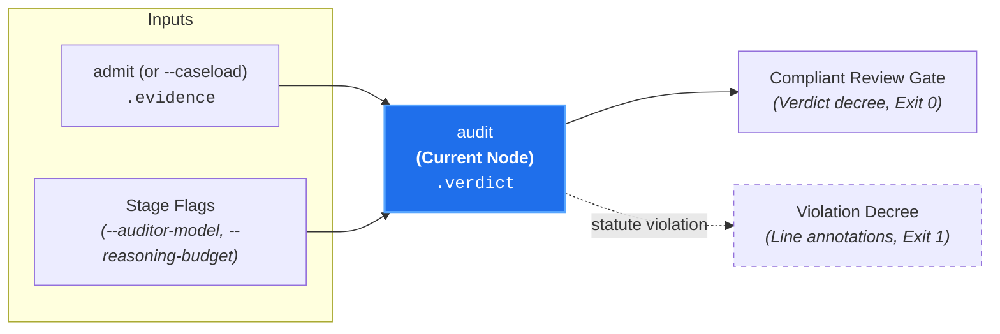

# Judicial Adjudication (`audit`)

**Status:** Authoritative Architectural Standard  
**Core Domain Engine:** Caseload Domain Engine  
**Driving Adapters:** CLI (`audit`), GitHub Action

---

## 1. Domain Concept & Role (`core`)

`audit` performs **Substantive Adjudication: Merits Evaluation & Verdict Generation** for all active cases. In the court clerkship taxonomy, it represents the Judge taking the bench, hearing arguments on the admitted exhibits, evaluating affirmative defenses (`Exception`), and rendering formal decrees with actionable remediation.

- **Imperative Verb:** `audit`
- **Court Clerkship Role:** Judicial trial and decree rendering.
- **Metric Pair:** `compliance_score` (number [0.0, 1.0]) and `compliance_summary` (string decree).
- **Core Question:** *"Given the admitted exhibits and governing invariant/exceptions, does the evidence comply with canon statute?"*

---

## 2. Dependencies & Prerequisites (`core`)



- **Direct Prerequisites:** `admit` (requires admitted exhibits in `caseload.evidence`).
- **Transitive Prerequisites:** `intake`, `discover`, `validate`, `configure`, `docket`.
- **Pruned from Execution:** `probe` (never scheduled during review cascades).

---

## 3. Core Functional Contract

```text
struct AuditOptions:
  auditor_model?: String
  reasoning_budget?: Integer

function execute_audit(
  options: AuditOptions,
  caseload: Caseload
) -> Caseload
```

### Caseload Delta
Populates the `.verdict` field on the cumulative `Caseload`:

```text
struct CodeAnnotation:
  path: String
  start_line: Integer
  end_line: Integer
  start_column?: Integer
  end_column?: Integer
  annotation_level: "failure" | "warning" | "notice"
  message: String
  title?: String

struct CanonAdjudication:
  // Canon file path evaluated
  canon_path: String

  // Compliance score indicating statute adherence [0.0, 1.0]
  compliance_score: Float

  // Substantive decree explaining compliance or violation
  compliance_summary: String

  // Verdict status
  status: "pass" | "fail"

  // Line-level code annotations
  annotations: List[CodeAnnotation]

struct CaseloadVerdict:
  // Overall review gate outcome
  status: "pass" | "fail"

  // High-level verdict summary
  summary: String

  // Substantive adjudications per active case
  adjudications: List[CanonAdjudication]
```

---

## 4. Process & Domain Logic (`core`)

1. **One Trial per Case per Prompt Turn:**  
   Each active case is evaluated in an **independent, isolated trial**:
   - **Isolation:** Prevents cross-canon hallucination; Canon A's exceptions never bleed into Canon B's evaluation.
   - **Bounded Token Footprint:** Prompts only contain the governing canon and its admitted exhibits.
   - **Concurrency:** Independent trials execute concurrently across model calls in parallel.
2. **Frontier Reasoning Model Tier (`gemini-pro-latest`):**  
   Evaluates substantive compliance with extended thinking/reasoning enabled.
3. **The Four-Step Judicial Decision Tree:**
   - **Step 1 (Invariant Evaluation):** Evaluates admitted exhibits against the normative invariant (What). If compliant $\implies$ `compliance_score = 1.0`.
   - **Step 2 (Exception Screening):** If a violation is found, evaluates declared `Exception` clauses. If an exception's criteria are semantically satisfied $\implies$ short-circuits to conditional `pass` (`compliance_score >= 0.5`), documenting the matched exception.
   - **Step 3 (Remediation Formulation):** If no exception applies $\implies$ violation stands (`compliance_score < 0.5`), and formulates actionable contributor remediation (How).
   - **Step 4 (Line Annotations):** Emits precise file, line, and column coordinates for each violation.
4. **Constrained Decoding Schema (Reason-First):**  
   Enforces structured JSON output generating `compliance_summary` before `compliance_score`:
   ```json
   {
     "compliance_summary": "The added command flags adhere strictly to kebab-case formatting.",
     "compliance_score": 1.0,
     "annotations": []
   }
   ```
   Generating `compliance_summary` before `compliance_score` provides a chain-of-thought scratchpad, anchoring reproducible probability distributions.
5. **Deterministic Status Evaluation:**  
   The core domain engine deterministically assigns case `status = if compliance_score >= 0.5 { "pass" } else { "fail" }`, and aggregates overall `caseload.verdict.status` (`"pass"` if all cases pass, else `"fail"`).

---

## 5. Driving Adapter: CLI

The CLI exposes `audit` as its flagship evaluation command:

```bash
# Evaluate in-flight diff in telescoping mode:
git diff origin/main | canon-clerk audit --diff -

# Adjudicate an admitted Caseload from upstream pipeline:
canon-clerk audit --caseload caseload-5.json

# Output complete Caseload record to file:
git diff origin/main | canon-clerk audit --diff - --json > final-caseload.json
```

### Missing Input Source Guard (Naked Invocation)
Invoking `canon-clerk audit` naked without a filing source (no diff, no target files, no `--caseload`) fails fast with exit code `2` (Usage Error) and prints actionable guidance:
```text
error: No filing source provided for audit.
  Hint: Pipe a diff via standard input ('--diff -'), specify target files,
        or pass an upstream caseload ('--caseload <path>').
```
Conversely, if an explicitly designated stream yields zero diffs (e.g. `git diff origin/main | canon-clerk audit --diff -` on an up-to-date branch), the pipeline cleanly short-circuits with exit code `0` ("0 modified files; 0 candidate canons matched; audit pass").

### CLI Output & Stream Formatting
- **TTY Progress:** Displays interactive spinners and step execution traces on `stderr`.
- **Verdict Report:** Emits formatted Markdown or stylish terminal summary to `stdout`.
- **Telemetry Log:** Optionally redirects event stream via `--log-file <path>`.

### CLI Flags & Environment
- `--diff <path|->`: In-flight patch stream.
- `--caseload <path|->`: Ingests upstream Caseload.
- `--docket-threshold <number>`: Upstream jurisdiction screening threshold in telescoping mode (default: `0.5`).
- `--admit-threshold <number>`: Upstream evidence admissibility threshold in telescoping mode (default: `0.5`).
- `--auditor-model <model>`: Custom reasoning model specifier.
- `--reasoning-budget <tokens>`: Maximum reasoning budget tokens.
- `--log-file <path>`: Telemetry event stream destination.
- `--json`: Emits enriched Caseload JSON.

### CLI Exit Codes
- **0:** All evaluated cases pass (`status: 'pass'`, `compliance_score >= 0.5`), or 0 candidate canons matched from diff.
- **1:** Architectural violation detected (`status: 'fail'`, `compliance_score < 0.5`).
- **2:** Fatal error, missing filing source (naked invocation), missing credentials, or provider failure.

---

## 6. Driving Adapter: GitHub Action

1. **Full DAG Invocation:** Drives the complete Caseload pipeline to `executeAudit`.
2. **GitHub Check Run Creation:**
   - Creates a GitHub Check Run (`octokit.rest.checks.create`).
   - Maps overall status to Check Run conclusion:
     - `status: 'pass'` $\implies$ `conclusion: 'success'` 🟢
     - `status: 'fail'` $\implies$ `conclusion: 'failure'` 🔴
3. **Line-Level GitHub Annotations:** Converts `adjudications[].annotations` into Check Run annotations (`path`, `start_line`, `end_line`, `annotation_level: 'failure'`, `message`), placing visual review flags directly on the PR files diff tab.
4. **Markdown Step Summary:** Writes an executive decree and per-case breakdown to `$GITHUB_STEP_SUMMARY`.
