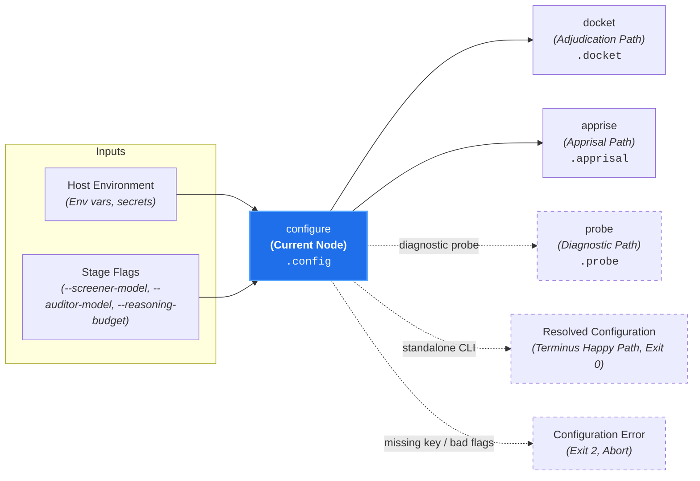

# Configuration & Environment (`configure`)

**Status:** Authoritative Architectural Standard  
**Core Domain Engine:** Caseload Domain Engine  
**Driving Adapters:** CLI (`configure`), GitHub Action

---

## 1. Domain Concept & Role (`core` / `configuration`)

`configure` serves as the **Operational Environment Normalizer** for Canon Clerk. In the court clerkship taxonomy, it represents the administrative court officer ensuring the courtroom facilities, judicial roster, and bailiff credentials are fully established before the court goes into session.

- **Imperative Verb:** `configure`
- **Court Clerkship Role:** Runtime environment resolution and provider credential validation.
- **Metric Pair:** N/A (Deterministic offline configuration resolution).

---

## 2. Dependencies & Prerequisites (`core`)



- **Direct Prerequisites:** None (Root node of Branch B).
- **Transitive Prerequisites:** None.
- **Independence:** Resolves environment credentials and models with zero dependencies on diffs or canons.
- **Lazy Evaluation in Cascades:** When executed within a review cascade (`docket`, `admit`, `audit`), `configure` is evaluated lazily *after* `discover` confirms matching candidate canons, guaranteeing that un-governed PRs pass cleanly without checking credentials.

---

## 3. Core Functional Contract

```text
struct ConfigureOptions:
  env?: Map[String, String]
  overrides?: CaseloadConfigOverrides

function execute_configure(
  options: ConfigureOptions,
  caseload?: Caseload
) -> Caseload
```

### Caseload Delta
Populates the `.config` field on the cumulative `Caseload`:

```text
struct CaseloadConfig:
  // Model specifier for screening nodes (default: 'google:gemini-flash-lite-latest')
  screener_model: String

  // Model specifier for adjudication (default: 'google:gemini-pro-latest')
  auditor_model: String

  // Optional reasoning budget in tokens
  reasoning_budget?: Integer
```

---

## 4. Process & Domain Logic (`configuration`)

1. **Credential Resolution:** Checks environment variables (`GEMINI_API_KEY`) and secure platform secret stores.
2. **Model Specifier Normalization:** Resolves model aliases (e.g. `flash-lite` $\implies$ `google:gemini-flash-lite-latest`, `pro` $\implies$ `google:gemini-pro-latest`).
3. **Deterministic & Offline:** Executes locally in <5ms without sending network requests or spending tokens.

---

## 5. Driving Adapter: CLI

The CLI exposes `configure` as an imperative subcommand:

```bash
# Normalize and print active configuration:
canon-clerk configure --json

# Override model tiers from flags:
canon-clerk configure --screener-model google:gemini-flash-lite-latest --auditor-model google:gemini-pro-latest
```

### CLI Flags & Environment
- `GEMINI_API_KEY`: Google Gemini API key.
- `--screener-model <model>`: Custom screener model specifier.
- `--auditor-model <model>`: Custom auditor model specifier.
- `--reasoning-budget <tokens>`: Maximum reasoning budget tokens.
- `--caseload <path|->`: Ingests upstream Caseload.

### CLI Exit Codes
- **0:** Configuration valid and normalized.
- **2:** Missing provider credentials (`GEMINI_API_KEY`) or invalid model identifiers.

---

## 6. Driving Adapter: GitHub Action

1. **Secret & Input Mapping:** Maps workflow inputs (`api-key`, `screener-model`, `auditor-model`, `reasoning-budget`) and repository secrets into `ConfigureOptions`.
2. **JIT Invocation:** Evaluates `execute_configure` only after `execute_discover` yields $>0$ candidate canons.
3. **Missing Secret Reporting:** If `GEMINI_API_KEY` is absent on a PR requiring AI adjudication, posts an actionable failure annotation instructing maintainers to configure repository secrets for fork PRs.
