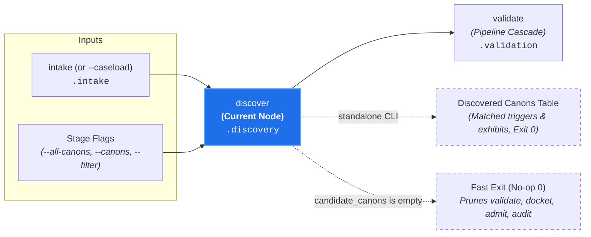

# Candidate Identification (`discover`)

**Status:** Authoritative Architectural Standard  
**Core Domain Engine:** Caseload Domain Engine  
**Driving Adapter:** CLI (`discover`)

---

## 1. Domain Concept & Role (`core`)

`discover` acts as the **Multi-Plane Relevance Sieve & Dual Pruning Gate** of the pipeline. In the court clerkship taxonomy, it represents the clerk reviewing tendered filings to resolve referenced files, verify state preconditions, enforce monorepo jurisdictional boundaries, and compare all tendered exhibits against the court's codified canons:

1. **Exhibit Materialization:** Resolves exhibit discovery directives (expanding directory recursion roots, matching globs against workspace checkout into concrete file exhibits).
2. **State Precondition Verification:** Evaluates `exists:` path patterns against the Target File Tree to ensure baseline environment dependencies exist before admitting candidate canons.
3. **Subordination & Scope Containment:** Enforces monorepo boundaries, ensuring scoped canons evaluate strictly within their enclosing `<scope>/`.
4. **Two-Sided Mutual Pruning:**
   - **Prunes Inapplicable Canons:** Canons with unmet `exists` preconditions or zero matching required exhibits are dropped $\implies$ `candidate_canons`.
   - **Prunes Un-inspected Exhibits:** Exhibits not inspected or triggered by any surviving candidate canon are dropped $\implies$ `active_exhibits` (preserving context-window hygiene).

- **Imperative Verb:** `discover`
- **Court Clerkship Role:** Exhibit materialization, precondition verification, scope containment, candidate canon identification, and mutual exhibit pruning.
- **Metric Pair:** N/A (Deterministic multi-plane intersection).

---

## 2. Dependencies & Prerequisites (`core`)



- **Direct Prerequisites:** `intake` (requires parsed target paths, diffs, or scope in `caseload.intake`, OR receives plenary `--all-canons` flag).
- **Transitive Prerequisites:** None.
- **Incoming Caseload:** Requires `caseload.intake` to be present (unless executing with `--all-canons`).

---

## 3. Core Functional Contract

```text
struct DiscoverOptions:
  workspace_root: String
  canon_globs?: List[String]
  explicit_canon_filter?: List[String]
  all_canons?: Boolean

function execute_discover(
  options: DiscoverOptions,
  caseload: Caseload
) -> Caseload
```

### Caseload Delta
Populates the `.discovery` field on the cumulative `Caseload`:

```text
struct ActiveExhibits:
  files: List[String]
  pr_title?: Boolean
  pr_body?: Boolean
  commit_messages?: Boolean
  linked_issues?: Boolean

struct CaseloadDiscovery:
  // Mode of discovery: trigger-filtered or full corpus
  mode?: "triggered" | "all-canons"

  // Modified target file paths evaluated
  target_files: List[String]

  // Discovered candidate canon paths matching targets (or full corpus)
  candidate_canons: List[String]

  // Materialized active exhibits retained after mutual pruning with candidate canons
  active_exhibits: ActiveExhibits

  // Map of canon paths to matched target file paths and inspected planes
  triggers_join: Map[String, List[String]]
```

### Domain Short-Circuit Invariant
If `candidate_canons` is empty:
- The core engine sets `candidate_canons: []` and returns the enriched Caseload.
- Downstream execution ceases immediately, returning a clean success state without evaluating configuration or spending tokens.

---

## 4. Process & Domain Logic (`core`)

1. **Exhibit Materialization:** Resolves exhibit discovery directives from `caseload.intake` (e.g. expanding directory recursion roots and matching target glob patterns against workspace checkout into concrete file exhibits).
2. **Plenary Canon Discovery (`--all-canons`):** When `allCanons: true` is passed (via `--all-canons`), path trigger intersection is bypassed. Every discoverable canon in the workspace is placed directly into `candidate_canons` with `mode: 'all-canons'`. This establishes the full statutory corpus for downstream `validate --all-canons` ("Codex Audit").
   - **Two Hemispheres Invariant:** `--all-canons` operates exclusively on the *governing rule packs*, distinct from `--all-targets` (in `intake`), which operates on the *subject-matter codebase*.
3. **Canon Corpus Enumeration:** Discovers all candidate canons across the workspace (default pattern: `**/.canons/**/*.md`).
4. **Monorepo Subordination & Scope Containment:** Enforces strict boundary encapsulation:
   - Global canons in `.canons/**` apply repository-wide.
   - Scoped canons located in `<scope>/.canons/**` automatically inherit an implicit `<scope>/**` boundary:
     - Scoped canons are never evaluated against files outside `<scope>/`. If zero modified target files reside in `<scope>/`, the canon is excluded from candidates.
      - All declared paths and glob patterns in `triggers:`, `exists:`, and `references:` are evaluated strictly relative to `<scope>/`. Any pattern attempting directory traversal superior to `<scope>/` (e.g. `../`) is rejected as a validation error.
      - Scoped canons requiring files outside `<scope>/` must be hoisted to a parent `.canons/` directory.
5. **State Precondition Verification (`exists:`):** Evaluates declared `exists:` path patterns against the **Target File Tree** representing the final state being tested (PR `HEAD` commit in CI, filesystem working directory in local CLI, or speculative plan in dry-run modes):
   - All patterns in `exists:` MUST match at least one file present in the Target File Tree. If any pattern matches zero files, the canon is skipped / pruned with a diagnostic notice.
   - For scoped canons, `exists:` preconditions are evaluated strictly against the Target File Tree within `<scope>/`.
6. **Bipartite Exhibit Matching (Required vs. Optional Exhibits):**
   - **Required Planes (Default, e.g. `diff`, `pr_body`):** Evaluated strictly. A canon is pruned unless all of its declared required exhibit planes are satisfied in the intake filing (e.g. modified files matching `triggers:` or present metadata).
   - **Optional Planes (`?` Suffix, e.g. `pr_title?`, `pr_body?`):** Evaluated opportunistically. If present on `caseload.intake`, they are retained as active exhibits for the canon; if absent (such as in local CLI diff-only audits), their absence never causes the canon to be pruned.
   - **Default Frontmatter Ergonomics:** Canons with omitted `inspect` frontmatter default to `["diff", "pr_title?", "pr_body?"]`, guaranteeing that standard code rules apply seamlessly in local CLI runs (where `diff` is present but PR metadata is absent) without requiring dummy metadata flags.
7. **Two-Sided Mutual Pruning & Token Hygiene:**
   - **Inapplicable Canons Pruned:** Any canon whose `exists:` preconditions are unmet, or whose `triggers:` match 0 file exhibits, or whose required `inspect:` exhibit planes are unsatisfied is dropped $\implies$ `candidate_canons`.
   - **Un-inspected Exhibits Pruned:** Any tendered exhibit (file path, `pr_title`, `pr_body`, etc.) that is neither triggered nor inspected by any surviving candidate canon is dropped $\implies$ `active_exhibits`. Downstream screening (`docket`) and adjudication (`audit`) will never serialize un-inspected exhibits into model prompts.
8. **Join Calculation:** Computes `triggers_join` mapping each candidate canon to the specific active exhibits that activated it.

---

## 5. Driving Adapter: CLI

The CLI exposes `discover` as an imperative subcommand:

```bash
# Evaluate discovery on in-flight diff stream:
git diff origin/main | canon-clerk discover --diff -

# Enumerate all canons across the repository corpus:
canon-clerk discover --all-canons

# Evaluate discovery against an upstream Caseload:
canon-clerk discover --caseload caseload-1.json --json

# Predicate mode (-q):
git diff origin/main | canon-clerk discover -q -
```

### CLI Flags & Options
- `--all-canons`: Discovers and compiles all repository canons into candidate_canons, bypassing path trigger matching.
- `-q, --quiet`: Predicate mode. Suppresses stdout and indicates match presence via exit code.
- `--canon <path|glob>`: Explicitly restrict candidate canons to a specific subset.
- `--format <stylish|json|compact>`: Formats matched canons and triggering files.
- `--caseload <path|->`: Ingests upstream Caseload JSON.
- `--output-caseload <path>`: Writes cumulative `Caseload` JSON to disk independently of terminal stdout.
- `--json`: Emits enriched Caseload JSON to stdout.

### CLI Exit Codes
- **0:** Candidate canons matched and discovery attached (or `--all-canons` enumerated).
- **0 (Short-Circuit):** Zero candidate canons matched from diff stream; logs summary and exits immediately.
- **1 (Predicate Mode `-q`):** Exits 1 if zero candidate canons matched.
- **2:** Usage error, missing input source (naked invocation), or invalid glob syntax.
