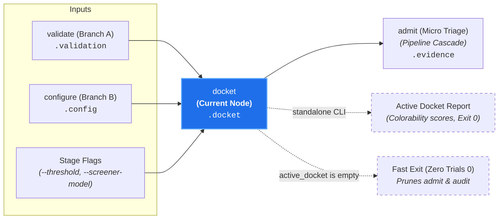

# Macro Jurisdiction Triage (`docket`)

**Status:** Authoritative Architectural Standard  
**Core Domain Engine:** Caseload Domain Engine  
**Driving Adapters:** CLI (`docket`), GitHub Action

---

## 1. Domain Concept & Role (`core`)

`docket` performs **Macro Triage: Subject-Matter Jurisdiction Screening** across all candidate canons. In the court clerkship taxonomy, it represents the clerk reviewing petitions against the court's subject-matter jurisdiction to determine whether a claim is legally colorable before opening a formal case file on the active docket.

- **Imperative Verb:** `docket`
- **Court Clerkship Role:** Macro triage establishing subject-matter jurisdiction.
- **Metric Pair:** `colorability_score` (number [0.0, 1.0]) and `colorability_summary` (string rationale).
- **Core Question:** *"Does this candidate canon have a colorable claim of jurisdiction over this PR as a whole?"*

---

## 2. Dependencies & Prerequisites (`core`)



- **Direct Prerequisites:**
  - `validate` (Branch A: validated candidate canons in `caseload.discovery` and `caseload.validation`).
  - `configure` (Branch B: resolved provider credentials and model specifiers in `caseload.config`).
- **Transitive Prerequisites:** `intake`, `discover`.
- **The Case or Controversy Invariant:** `docket` evaluates the subject-matter jurisdiction of candidate canons *as applied to a change*. It strictly requires an underlying filing (`caseload.intake` with target files, unified diff, or `--all-targets`). Invocations attempting to docket without a filing (e.g. `canon-clerk docket --all-canons` without targets) are rejected as invalid: a court cannot open an active docket of cases without a complaint or controversy.
- **Pruned from Execution:** `probe`, downstream adjudication nodes (`admit`, `audit`).

---

## 3. Core Functional Contract

```text
struct DocketOptions:
  threshold?: Float // default: 0.5
  screener_model?: String

function execute_docket(
  options: DocketOptions,
  caseload: Caseload
) -> Caseload
```

### Caseload Delta
Populates the `.docket` field on the cumulative `Caseload`:

```text
struct ColorabilityAssessment:
  // Numerical score indicating colorable subject-matter jurisdiction [0.0, 1.0]
  colorability_score: Float

  // Reasoning justifying whether jurisdiction applies to the PR context
  colorability_summary: String

  // Status outcome
  colorability_status: "docketed" | "dismissed"

struct CaseloadDocket:
  // Colorability assessments keyed by canon path
  cases: Map[String, ColorabilityAssessment]

  // List of canon paths admitted onto the Active Docket
  active_docket: List[String]

  // Optional diagnostic anomalies manifest
  anomalies?: DocketAnomaliesManifest
```

### Domain Short-Circuit Invariant
If `active_docket` is empty:
- Execution terminates immediately with exit code `0` (or returns empty active docket).
- Zero substantive trials (`audit`) are scheduled, avoiding hundreds of thousands of deep-reasoning tokens.

---

## 4. Process & Domain Logic (`core`)

1. **Aggregate Single-Turn Screening:**  
   Evaluates **all candidate canons in a single aggregate prompt turn** using `gemini-3.5-flash-lite`.
2. **Constrained Grammar Decoding:**  
   Forces structured JSON output with guaranteed schema keys:
   ```json
   {
     "cases": {
       ".canons/cli/cli-flags-kebab-case.md": {
         "colorability_score": 0.95,
         "colorability_summary": "PR introduces new command flags in CLI.",
         "colorability_status": "docketed"
       }
     }
   }
   ```
3. **Threshold Gate (`colorability_score >= 0.5`):**
   - Canons scoring $\ge 0.5$ establish jurisdiction and are entered into `active_docket`.
   - Canons scoring $< 0.5$ are marked `dismissed` with summary rationale.
4. **Latency & Token Economy:** Executes in ~400ms, expending only ~1,200 tokens across 20+ candidate canons.

---

## 5. Driving Adapter: CLI

The CLI exposes `docket` as an imperative subcommand:

```bash
# Execute macro triage against an upstream Caseload:
canon-clerk docket --caseload caseload-3.json --json

# Run telescoping pipeline stopping at docket:
git diff origin/main | canon-clerk docket --diff -
```

### Missing Input Source Guard (Naked Invocation)
Invoking `canon-clerk docket` naked without a filing source (no diff, no target files, no `--caseload`) fails fast with exit code `2` (Usage Error) and prints actionable guidance:
```text
error: No filing source provided for docket.
  Hint: Pipe a diff via standard input ('--diff -'), specify target files,
        or pass an upstream caseload ('--caseload <path>').
```
Conversely, if an explicitly designated stream yields zero diffs (e.g. `git diff origin/main | canon-clerk docket --diff -` on an up-to-date branch), the pipeline cleanly short-circuits with exit code `0` ("0 modified files; active docket empty").

### CLI Flags & Environment
- `--threshold <number>`: Jurisdiction screening threshold (default: `0.5`).
- `--caseload <path|->`: Ingests upstream Caseload.
- `--json`: Emits enriched Caseload JSON.

### CLI Exit Codes
- **0:** Candidate canons screened and active docket established (or empty docket short-circuit).
- **2:** Usage error, missing filing source (naked invocation), provider connection error, invalid API key, or malformed model response.

---

## 6. Driving Adapter: GitHub Action

1. **Macro Screening Step:** Calls `executeDocket` with the cumulative `Caseload`.
2. **Telemetry Reporting:** Logs screened candidate canons and active docket admissions to workflow step output.
3. **Early Exit:** If `active_docket` is empty, marks the Check Run successful with a notice that all candidate canons were dismissed at screening, concluding the PR review in <3 seconds.
