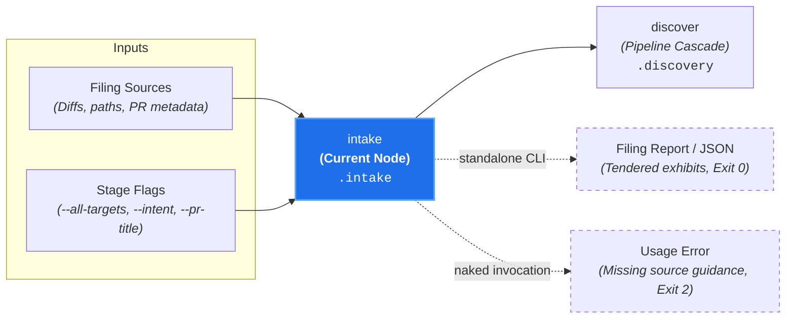

# Filing Intake (`intake`)

**Status:** Authoritative Architectural Standard  
**Core Domain Engine:** Caseload Domain Engine  
**Driving Adapter:** CLI (`intake`)

---

## 1. Domain Concept & Role (`core`)

`intake` serves as the **Universal Front Door** of the Canon Clerk evaluation pipeline. In the court clerkship taxonomy, it represents the formal clerk receiving in-flight filings at the intake counter. It catalogs the initial **tendered exhibits** (literal metadata such as `pr_title`, `pr_body`, `commit_messages`, `linkedIssues`, and unified patch streams) alongside **exhibit discovery directives** (explicit file paths, directory pointers for recursive traversal, and glob patterns) into standardized, immutable structures on the `Caseload`.

- **Imperative Verb:** `intake`
- **Court Clerkship Role:** Filing intake, document receipt, and cataloging of tendered exhibits.
- **Metric Pair:** N/A (Deterministic filing track).

---

## 2. Dependencies & Prerequisites (`core`)



- **Direct Prerequisites:** None (Root node of Branch A).
- **Transitive Prerequisites:** None.
- **Incoming Caseload:** May accept an empty or existing `Caseload` record.
- **Subprocess Isolation:** **Zero child-process VCS execution.** The core domain engine does not run `git` subprocesses internally; driving adapters feed diffs and target paths directly via domain interfaces.

---

## 3. Core Functional Contract

```text
struct IntakeOptions:
  pr_title?: String
  pr_body?: String
  intent?: String
  target_paths?: List[String]
  patch_content?: String
  all_targets?: Boolean
  linked_issues?: List[LinkedIssueContext]

function execute_intake(
  options: IntakeOptions,
  caseload?: Caseload
) -> Caseload
```

### Caseload Delta
Populates the `.intake` field on the cumulative `Caseload`:

```text
struct CaseloadIntake:
  // PR title or commit subject
  pr_title?: String

  // PR markdown description or commit body
  pr_body?: String

  // Design intent or prospective plan description
  intent?: String

  // Scope of intake targets
  scope?: "targeted" | "all-targets"

  // Ingested code modifications keyed by relative repository path
  diffs: Map[String, FileArtifact]

  // Optional linked issue context gathered from issue trackers
  linked_issues?: List[LinkedIssueContext]
```

---

## 4. Process & Domain Logic (`core`)

1. **Input Source Resolution & Missing Source Invariant:** Requires an explicitly designated input source: positional target paths, unified diff (`--diff <path|->`), stdin token stream (`-`), `--all-targets`, or an incoming `--caseload`.
   - **Missing Source Guard (Naked Invocation):** Invoking `canon-clerk intake` with zero sources fails fast with exit code `2` (Usage Error) and prints actionable remediation guidance. The CLI never silently hangs waiting for input on a TTY.
   - **Empty Stream Outcome (Legitimate No-op):** An explicitly designated source that yields zero changes (e.g. `git diff origin/main | canon-clerk intake --diff -` on a clean branch) successfully produces an empty filing (`diffs: {}`, `targetPaths: []`) and exits `0`.
2. **Tendered Exhibits Cataloging:** Captures raw literal exhibits directly from the invocation context:
   - Metadata exhibits: `pr_title`, `pr_body`, design `intent`, and any `linkedIssues`.
   - File exhibits: Unified patch hunks parsed into immutable `FileArtifact` objects (`linesAdded`, `linesDeleted`, `patch`, `status`).
3. **Exhibit Discovery Directives Cataloging:** When file paths, directory pointers, or glob patterns are provided, packages them as directives for downstream resolution in `discover`.
4. **Target Scope Normalization:** When `allTargets: true` is passed, flags `scope: 'all-targets'` to instruct `discover` to materialize the entire repository codebase as target exhibits. (Note the crucial distinction: `--all-targets` operates on the *subject-matter codebase*, whereas `--all-canons` in `discover` operates on the *governing rule packs*).
5. **Filesystem Context Verification:** Verifies local file existence and stat metadata for explicitly named file exhibits.

---

## 5. Driving Adapter: CLI

The CLI exposes `intake` as an imperative subcommand that adapts terminal arguments and POSIX streams:

```bash
# Ingest via direct target paths:
canon-clerk intake src/main.rs
canon-clerk intake 'src/**/*.ts'

# Ingest via prospective design intent:
canon-clerk intake --intent "Implement round-robin auth provider rotation" src/auth

# Ingest via newline-delimited stdin path tokens:
git diff origin/main --name-only | canon-clerk intake -

# Ingest via unified diff stream:
git diff origin/main | canon-clerk intake --diff -

# Ingest all repository files as target artifacts:
canon-clerk intake --all-targets

# Ingest upstream caseload and attach intake:
canon-clerk intake --diff pr-42.patch --caseload existing.json --json
```

### CLI Flags & Environment
- `-` (Positional): Reads newline-delimited paths from stdin.
- `--diff <path|->`: Ingests unified diff patch from file or stdin.
- `--intent <text>`: Ingests prospective design intent or plan description.
- `--all-targets`: Ingests all repository files as target artifacts (used for full-repo sweeps).
- `--pr-title <text>`: Ingests PR title text.
- `--pr-body <text>` / `--pr-body-file <path>`: Ingests PR description.
- `--caseload <path|->`: Ingests existing Caseload JSON.
- `--json`: Emits enriched Caseload JSON to stdout.

### CLI Exit Codes
- **0:** Successful intake (including an empty filing from a clean diff stream).
- **2:** Usage error, missing input source (naked invocation), unresolvable paths, or corrupted diff stream.
