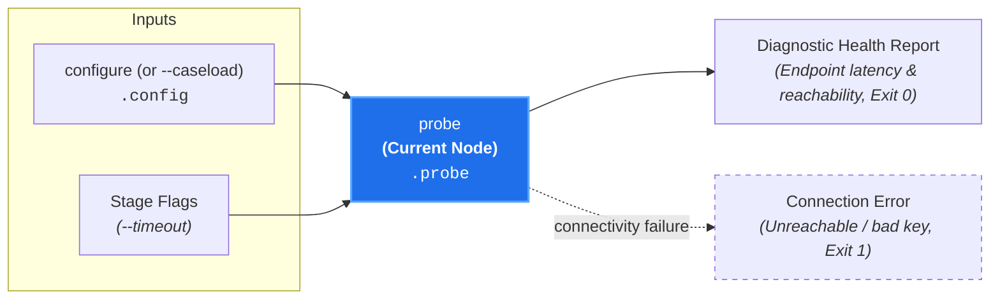

# Diagnostic Health Check (`probe`)

**Status:** Authoritative Architectural Standard  
**Core Domain Engine:** Caseload Domain Engine  
**Driving Adapters:** CLI (`probe`), GitHub Action

---

## 1. Domain Concept & Role (`core` / `configuration`)

`probe` serves as the **Diagnostic Network Health Check** for configured model endpoints. In the court clerkship taxonomy, it represents testing the teleconferencing equipment and audio-visual communication links before a remote hearing begins.

- **Imperative Verb:** `probe`
- **Court Clerkship Role:** Live connectivity and latency verification of provider endpoints.
- **Metric Pair:** N/A (Live connectivity probe; reports `status` and `latency_ms`).

---

## 2. Dependencies & Prerequisites (`core`)



- **Direct Prerequisites:** `configure` (requires resolved provider credentials and model specifiers in `caseload.config`).
- **Transitive Prerequisites:** None.
- **Pruned from Cascades:** `probe` is **never executed during review cascades** (`canon-clerk audit`). This ensures that evaluation runs do not incur redundant health-check latency prior to screening.

---

## 3. Core Functional Contract

```text
struct ProbeOptions:
  timeout_ms?: Integer

function execute_probe(
  options: ProbeOptions,
  caseload: Caseload
) -> Caseload
```

### Caseload Delta
Populates the `.probe` field on the cumulative `Caseload`:

```text
struct ProbeEndpointResult:
  // Connection outcome
  status: "ok" | "error"

  // Roundtrip response latency in milliseconds
  latency_ms: Integer

  // Resolved model identifier probed
  model: String

  // Error message if connectivity failed
  error?: String

struct CaseloadProbe:
  // Screener model endpoint probe result
  screener: ProbeEndpointResult

  // Auditor model endpoint probe result
  auditor: ProbeEndpointResult
```

---

## 4. Process & Domain Logic (`configuration`)

1. **Endpoint Resolution:** Reads configured `screener_model` and `auditor_model` from `caseload.config`.
2. **Ping Request Assembly:** Constructs lightweight probe requests (0 reasoning tokens, minimum prompt payload) to verify authentication and reachability.
3. **Concurrent Probe:** Concurrently sends probe requests to both endpoints in parallel:
   - Measures roundtrip response latency in milliseconds (`latency_ms`).
   - Verifies model availability and provider credential validity.
4. **Diagnostic Record:** Attaches endpoint latency and reachability metadata to `Caseload.probe`.

---

## 5. Driving Adapter: CLI

The CLI exposes `probe` as an imperative subcommand:

```bash
# Human-readable connectivity and latency check:
canon-clerk probe

# Emit structured JSON probe record:
canon-clerk probe --json
```

### CLI Flags & Options
- `--timeout <ms>`: Request timeout in milliseconds (default: `5000ms`).
- `--caseload <path|->`: Ingests upstream Caseload.
- `--json`: Emits enriched Caseload JSON.

### CLI Exit Codes
- **0:** All configured endpoints are reachable, authenticated, and responsive.
- **2:** Provider credentials rejected (401/403) or endpoints unreachable (timeout / 5xx).

---

## 6. Driving Adapter: GitHub Action

1. **Diagnostic Action Step:** Invoked in dedicated connectivity workflows or self-hosted runner validation actions.
2. **Summary Emission:** Emits reachability tables and latency metrics to `GITHUB_STEP_SUMMARY`.
3. **Fail-Fast Gating:** Fails CI pipelines early if remote AI provider endpoints are down or firewall rules block egress.
