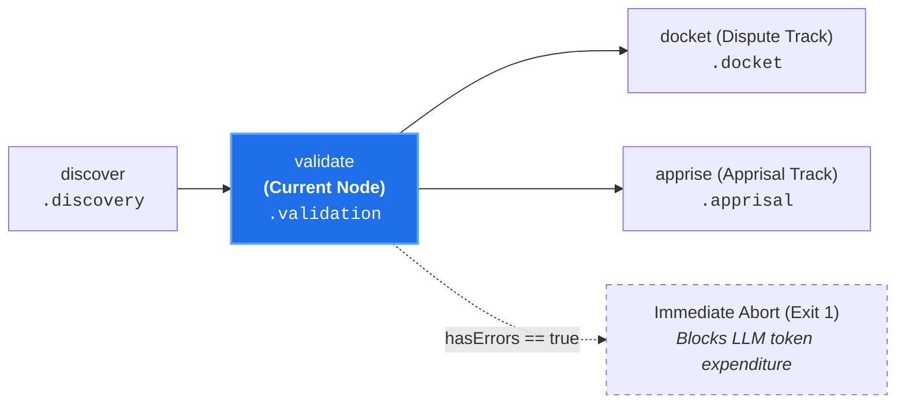

# Statutory Rule Linter (`validate`)

**Status:** Authoritative Architectural Standard  
**Core Domain Engine:** Caseload Domain Engine  
**Driving Adapters:** CLI (`validate`), GitHub Action, Integration Tests

---

## 1. Domain Concept & Role (`core`)

`validate` serves as the **Statutory Validity Gate** of the pipeline. In the court clerkship taxonomy, it represents the clerk reviewing submitted legal statutes and citations to verify that the law is correctly codified, has not suffered textual corruption, and conforms to jurisdictional formatting standards before being cited in court.

- **Imperative Verb:** `validate`
- **Court Clerkship Role:** Pre-flight linting and AST verification of canon rule files.
- **Metric Pair:** N/A (Deterministic static analysis).

---

## 2. Dependencies & Prerequisites (`core`)



- **Direct Prerequisites:** `discover` (strictly validates `caseload.discovery.candidateCanons`).
- **Transitive Prerequisites:** `intake`.
- **Topological Invariant:** `validate` does not maintain alternate roots or bypass `discover`. Instead, `discover` provides the candidate set:
  - **Facial Codex Review:** When invoked with `--all-canons`, `discover` populates `candidateCanons` with all repository canons.
  - **As-Applied Targeted Review:** When invoked with a diff or file paths, `discover` populates `candidateCanons` via trigger glob matching.
- **Incoming Caseload:** Strictly requires `caseload.discovery` to be present.

---

## 3. Core Functional Contract

```text
struct ValidateOptions:
  workspace_root: String
  max_warnings?: Integer

function execute_validate(
  options: ValidateOptions,
  caseload: Caseload
) -> Caseload
```

### Caseload Delta
Populates the `.validation` field on the cumulative `Caseload`:

```text
struct ValidatedCanonMetadata:
  result: "pass" | "fail"
  warning_count: Integer
  warnings: List[String]
  error_count: Integer
  errors: List[String]

struct CaseloadValidation:
  // Map of canon paths to AST/schema validation metadata
  results: Map[String, ValidatedCanonMetadata]

  // True if any candidate canon contains lint errors
  has_errors: Boolean
```

### Domain Error Invariant
If `hasErrors === true`, the validation result records the failure diagnostics and signals an immediate abort before loading environment credentials or spending tokens.

---

## 4. Process & Domain Logic (`core`)

1. **Candidate Intake:** Extracts `candidateCanons` from `caseload.discovery` (which was populated upstream either via path-trigger discovery or plenary `--all-canons` discovery).
2. **AST Parsing:** Parses Markdown AST and YAML frontmatter blocks.
3. **Static Rule Verification:**
   - **Frontmatter Schema:** Validates YAML types (`id`, `title`, `triggers`, `exists`, `inspect`, `tags`, `references`).
   - **Scope Containment Verification:** Enforces that scoped canons located in `<scope>/.canons/**` do not attempt directory traversal (e.g. `../`) or declare paths superior or external to `<scope>/` in `triggers:`, `exists:`, or `references:`.
   - **RFC 2119 Formulations:** Verifies normative keyword usage (`MUST`, `SHOULD`, etc.) in uppercase.
   - **Canon Naming Standard:** Enforces invariant slug naming conventions (`canon-names-must-state-invariants`).
   - **Rule Atomicity:** Ensures single-rule cohesion; flags compound invariants.
   - **Directive Headers:** Validates `Exception`, `Rationale`, and `Remediation` directive blocks.
4. **Diagnostic Assembly:** Assembles structured warnings and errors per canon.

---

## 5. Driving Adapter: CLI

The CLI exposes `validate` as an imperative subcommand:

```bash
# Validate full repository canon corpus (Codex Audit):
canon-clerk validate --all-canons

# Validate candidate canons triggered by in-flight diff stream:
git diff origin/main | canon-clerk validate --diff -

# Validate candidates on an existing Caseload:
canon-clerk validate --caseload caseload-2.json --json
```

### Missing Input Source Guard (Naked Invocation)
Invoking `canon-clerk validate` naked with zero sources (no diff, no target files, and no `--all-canons` flag) fails fast with exit code `2` (Usage Error) and prints actionable guidance:
```text
error: No filing source or canon scope provided for validate.
  Hint: Pass '--all-canons' to validate the entire repository corpus,
        or provide a diff ('--diff -') or target files to validate triggered canons.
```

### CLI Flags & Environment
- `--all-canons`: Validates all canons in `.canons/**` by directing discovery to yield the full corpus.
- `--max-warnings <n>`: Warning threshold before triggering non-zero exit code.
- `--format <stylish|json|compact>`: Output formatting choice.
- `--quiet`: Suppress warnings and non-essential output.
- `--caseload <path|->`: Ingests upstream Caseload.

### CLI Exit Codes
- **0:** All evaluated candidate canons pass static linting (or 0 candidate canons matched from diff).
- **1:** Validation errors detected, or warnings exceed `--max-warnings`.
- **2:** Usage error, missing input source (naked invocation), or file access failure.

---

## 6. Driving Adapter: GitHub Action

1. **Pre-Flight Validation:** Executes `executeValidate` on all candidate canons identified during `discover`.
2. **Annotation Generation:** Converts syntax or schema errors into GitHub Actions error annotations (`::error file=path,line=n::message`), pointing PR authors to the exact line of the malformed canon.
3. **Fail-Fast:** If `hasErrors === true`, posts a failing Check Run conclusion and stops the action run before contacting model providers.

---

## 7. Driving Adapter: Integration Tests

Integration tests invoke `executeValidate` on fixture canons containing deliberately malformed frontmatter, non-atomic invariants, and invalid RFC 2119 syntax, verifying that AST errors are captured deterministically across test runners.
